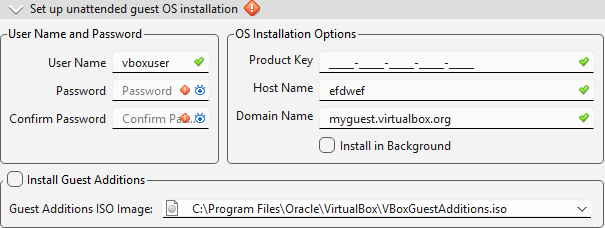
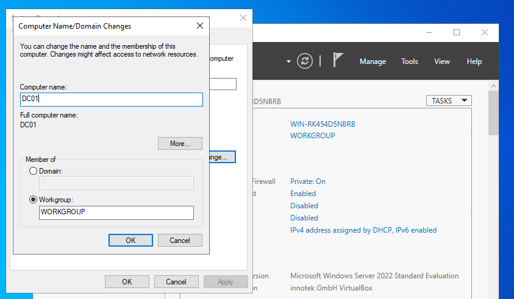
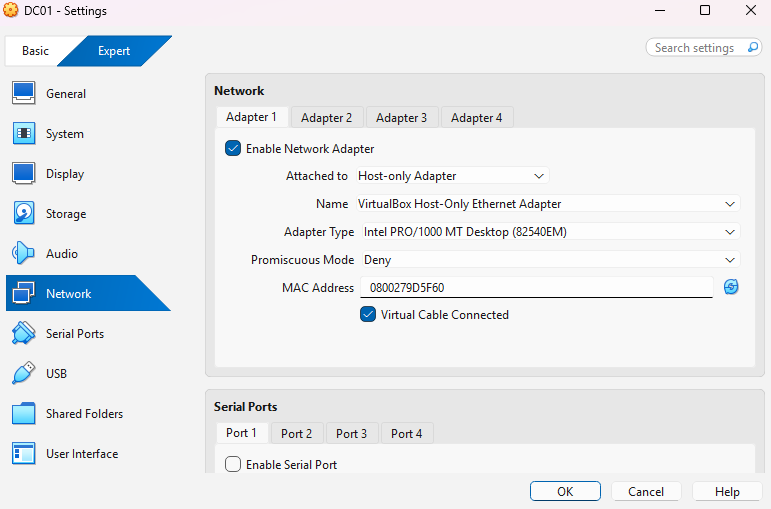
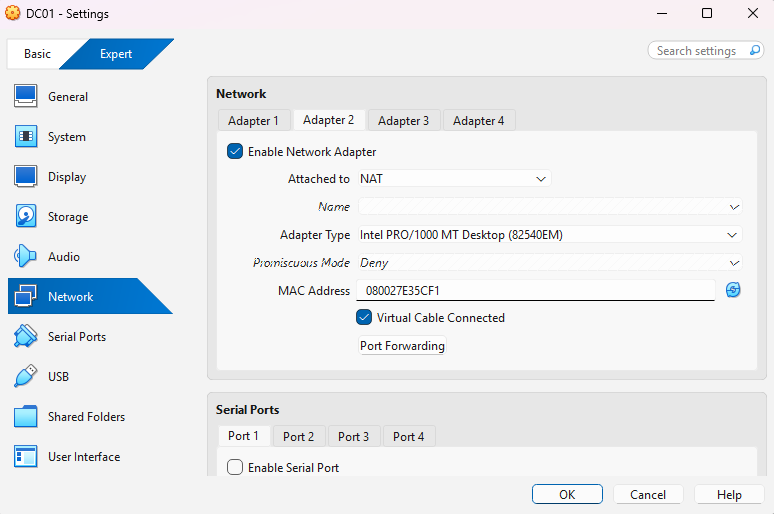
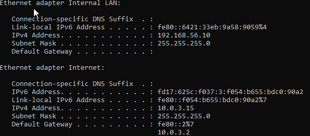

# Preparation and configuration of the domain controller  
In this lab, i'm going to go through the setup of installing and configuring the domain controller.  

## VM design decisions

I'm going to use VirtualBox to run the virtual environment and install my VM "Windowsm Server", these are the following specs:
- VM Name: **DC01**
- OS Edition: **Windows Server 2022**
- Memory: **4096 MB "4 GB"**
- CPU: **2 CPU'S**
- Harddisk: **80 GB VDI "VirtualBox Disk Image" Dynamic**
  - Dynamic: This means the virtual disk consumes physical storage on the host "my PC" on as data is writtren inside the OS. The disk expands automatically up to the configured maximum size "80 GB". In other words, the VM does not reserve all 80 GB on the host PC from the beginning.

**IMPORTANT**  
NOTE: My default *Unattended installation is checked*, I disabled the option during VM creation. The unattended setup automatically applies predefined identity and systenm configurations such as user accounts, hostname, and DNS suffix "Domain name". For my project I went with a manual installation to ensure a clean baseline server and full admin control over all configurations. This allows the server identity, networking configuration, and later Active Directory domain setup to be defined as part of the learning and documentation.

EXAMPLE OF UNATTENDED INSTALLATION "NOT CHOSEN"  

User name and password section:
- VirtualBox creates a local user automatically during Windows installation
- It does not log us in as the built-in Admin account
- It creates a seperate local account (vboxuser) and password we enter

OS Installation options section: 
- Hostname: The name of the server
- Domain name: This field does not refer to an Active Directory domain. It specifies a temporary DNS suffix automatically applied during automated Wiondows setup. This suffix is used to create a network identity for the VM during installation, forexample DC01.myguest.virtualbox.org. Since this project requires creating an Active Directory domain manually during domain controller promotion, this automatic DNS suffix was avoided to maintain a clean server config before AD DS deployment. 

## Rename Server
When we created the VM and named it DC01, we then only named the VM inside of VirtualBox. The name then only belongs to the hypervisor, not to Windows.

VirtualBox VM name:
- Used only by VirtualBox to identify the VM on my host PC

Windows computer name:
- Used by the operating system and the network

**Why renaming must happen before installing AD DS?**  
When we promote a server to a domain controller:
- The hostname becomes permanently embedded in Active Directory.
- DNS records are created using that name.
- Changing it later is complex

To change the hostname of the server:
- Server Manager - Local Server - Computer name - Change:  

## Network configuration
Normally, in on a domain controller some of the first steps in a network configuration would be to:
- Disable DHCP and configure a static IP address for the Server
- Make sure to set the correct subnetmask
- Configure DNS, on a domain controller the DNS server should be the domain controller itself. 

In VirtualBox when installing a VM, VirtualBox then by default creates adapter 1 enables it and sets it up to run NAT. This basically means that it creates a virtual network and VirtualBox will act ass a virtual routher handling the network address translation, so by default if the VM wants to access the internet is:
- VM -> VirtualBox "Virtual routher running NAT" -> physical PC -> Physical home routher

I had to stop and think ahead and ask myself if this is going to cause me any problems later because the goal is to domain join clients to the domain controller and later I would also want to ensure that I would be able to configure **hybrid setup using PHS**. 

Why is NAT-only going to be a problem?
- VirtualBox creates a small routher per VM group
- Some broadcast and service discovery behaviours are limited
- It does not perfectly simulate a real network since every VM will hide behind a virtual router and have its own LAN

 NAT only setup is not reliable for a realistic AD lab with the requirements that I have, also AD depends on real LAN behaviour.

To solve this problem and future proof my lab I had to install an additional adapter "Host-only adapter" on the domain controller, this means the VM will have to adapters enabled:
- Host-Only adapter = internal company LAN
- NAT adapter = simulated internet edge

To install the two adapters we need to power of the VM, then inside Virtual box i've done the following configuration:  
Adapter 1:  

Adapter 2:  

Finally, I'll open command promt and type ipconfig just show and verify my IP settings:  

**Internal traffic -> 192.168.56.X**  
**Internet traffic -> 10.0.3.2**  

Just to conclude: In this setup, VirtualBox acts as the router for internet traffic. The NAT adapter provides a virtual default gateway, which allows the virtual machines to reach the internet. The Host-Only adapter is used as the internal network where all Active Directory and DNS communication takes place.

This setup keeps the internal domain network isolated while still allowing outbound internet access for updates and future hybrid configuration.

I could also have used other setups that would simulate an enterprise environment a bit better, but that would require the domain controller to run several other roles such as DHCP and RRAS "routing". I want to dedicate the server to identity and therefore I chose this setup. Also in another module I'll go into depth on DNS since this is a very important part of AD DS. 
