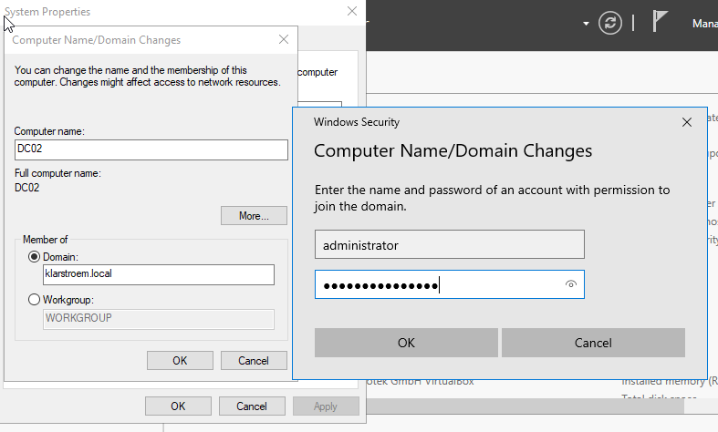
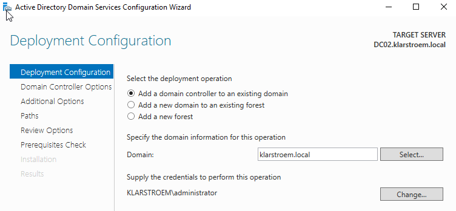
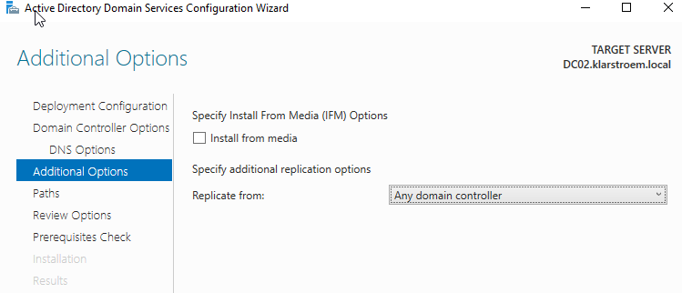
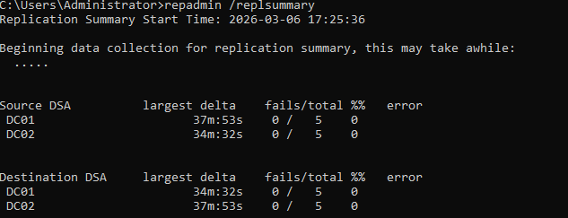
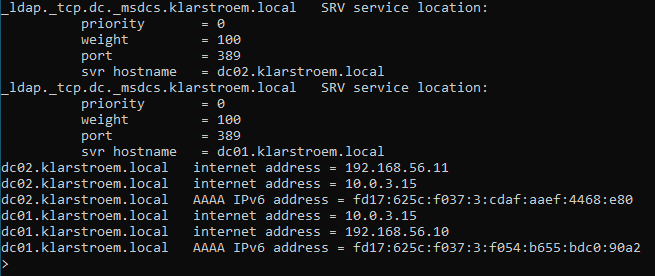
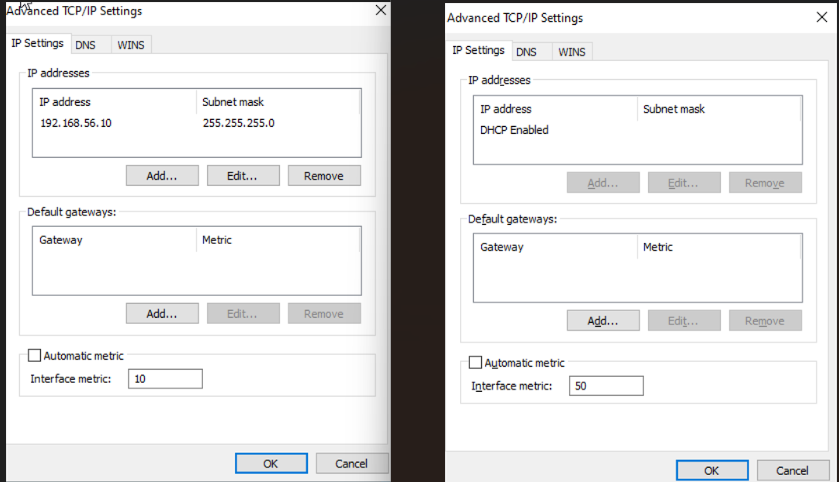

# Deploying a second domain controller

## Overview
This lab documents the deployment of a second domain controller to our AD environment. The goal is to provide redundancy, enable replication between DC'S, and improve the resiliance of authentication and DNS services.

I the previous lab [domain controller deployment](https://github.com/RebinW/active-directory-domain-services/blob/main/01-domain-controller-deployment/01-domain-controller-deployment.md) I went through each step on how to install AD DS and how to promote the server to be a domain controller. In this module I wont document the same step, but instead focus on what to be aware of when deploying a second domain controller to an existing domain.

## Objectives
1. Understanding the importance of multiple domain controllers.
2. Configure a second domain controller in an existing domain.
3. Verify Active Directory replication.
4. Verify DNS replication between domain controllers.

## Environment
- **Domain:** KlarStroem.local
- **Network:** 192.168.56.0/24
- **Servers:**
  - DC01 - Primary domain controller
  - DC02 - Additional domain controller  
- **Technologies:**
  - VirtualBox
  - Windows Server 2019
  - Active Directory Domain Services
  - DNS server

**Insert diagram here later**

## Implementation
#### Step 1: Installing Windows Server and configuring network settings
As mentioned previously, we're not going through setting up the VM in detail because the specs are the same as DC01. After Windows Server have been installed I then configured the network settings:

- **Host-Only adapter:**
  - Static IP address: 192.168.56.11/24
  - DNS: 192.168.56.10 "DC01"
  - Default gateway: none
- **NAT Adapter:**
  - Uses DHCP for network configuration

**Important:** Before installing AD DS and promotion of the server, the server must join the domain "klarstorem.local" to establish a trust relationship with Active Directory. This trust relationship will allow authentication with the existing domain controller "DC01", which is required during promotion because our new domain controller must replicate the Active Directory database from an existing domain controller. For this reason I configured the DNS to point to DC01, so that the server can find the existing domain controller and join the domain.

#### Step 2: Domain join DC02
We made sure that DNS settings points to DC01, this ensures that the server can locate the existing domain controller.

There are several ways to join a device to a domain, I used the following path; Server manager -> Local Server -> Domain -> Change.

In the section **Member of** we chose domain and type the name: klarstroem.local, it will then ask us to authenticate.

We have now succesfully joined the server to the domain, and the server has become a **Member Server**. If we look under Users and Computers, DC01 will then appear as a client under computers. In the next step after promotion we'll see that DC02 will no longer be a member server but instead a domain controller, therefore it will no longer appear under **Computers** but instead under **Domain controllers**.

Most importantly, we have now build the trust relationship so that replication can happen succesfully during promotion.

#### Step 3: Installing AD DS and promoting DC02 to a domain controller
After we have successfully joined the server to the domain, we then start with installing the AD DS role on the server "exactly the same as in the previous lab".

After installation, in Server Manger will notice a yellow triangle wit an exclamation mark under notifications, here it will asks us to promote the server to become an domain controller.

From here, we have to select the deployment operation. Out of the three options we're presented with we are of course going to choose **Add a domain controller to an existing domain**. 

After it will ask us to include Global Gatalog and Install DNS Server, and after we continue under **Additional Options** we can specify replication options. We only have DC01 so we can just choose to replicate from any domain controller, but we in a real organization they would chose to replicate from the domain controller closets for performance reasons.

From here we just continue through the installer and the domain controller will be promoted successfully. 

#### Step 4: Change DNS Settings.
Both servers are now domain controller and both host DNS services. So now each domain controller should reference itself for DNS as primary and the other domain controller as secondary. We would want to do this for two main reasons:
1. Local DNS resolution: If the DC queries its own DNS server first, the lookup is faster and independent of the network
2. Redundancy: If one DC fails, then DNS queries can still be resolved by the other server.

- **DC01:**
  - Primary DNS: 192.168.56.10
  - Secondary DNS: 192.168.56.11
- **DC02:**
  - Primary DNS: 192.168.56.11
  - Secondary DNS: 192.168.56.10

## Verification

**Test 1: Verify Active Directory replication**  
We haven't yet started creating objects in our domain, but there are other ways we can test replication between domain controllers. A common way is to open command promt and type *repadmin / replsummary:*

This outcome provides data of replication health between domain controllers. The output shows that DC01 and DC02 successfully replicate all partitions without failures. Please see next lab for detailed replication analysis.

**Test 2: Verify that both DC are advertized in DNS**  
When we later in the project join a client to the domain, we then want to ensure that the client PC can locate both domain controller. The client would send a DNS query for the SRV record: _ldap._tcp.dc._msdcs.klarstroem.local and DNS should then respond with a list of domain controller that provide ldap services for the domain: 

The test shows that both **dc02.klarstroem.local** and **dc01.klarstroem.local** is advertized. It also maps the domain names to IP addresses that the clients would connect to. I'll explain DNS concepts and Zones in depth in the DNS Module.

## Results  
DC02 was successfully added as a second domain controller in the klarstroem.local domain. Replication between DC01 and DC02 was verified and completed without errors accrpss all partitions.

Dns checks confirmed that both domain controller are advertized through the domain's SRV records. This means domain clients can discover and authenticate against both domain controllers.

The environment now has two domain controller providing redundancy for authentication, directory services and DNS. 

## Lessons Learned  
I've encountered two problems during this lab:

**1. Never ending promotion of the server**  
During the promotion of the server to become a domain controller, the installation took forever and never returned an error just kept installing. I knew that one of the main task during promotion was that it had to replicate the AD server from DC01.

I therefore tested the connection by pinging 192.168.56.10 and it could reach the server without any issues. I thought that maybe during promotion Windows for some reason would prioritze the NAT adapter over the Host-Only adapter, so I tried to disable the NAT adapter while it was still promoting. As soon as I disabled the adapter the installation went through right away. 

Since most of the communicating in by lab is going to be internal, but later also requires internet access for hybrid setup, disableing the NAT adapter is not a long term solution. What I've done instead is to tell the server to priorize the Host-only adapter over the NAT adapter. I did this by setting the metric to 10 on the Host-Only adapter and setting the metric to 50 on the NAT adapter: 

