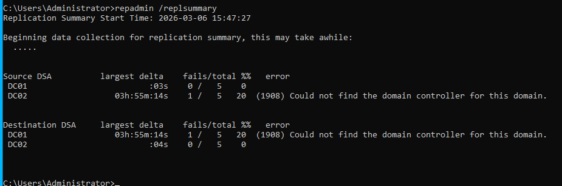

# Active Directory replication between domain controllers

## Overview  
In this lab we will look at how replication works between domain controllers in an Active Directory environment. The goal is to verify that data is synchronized between controllers and to learn how to check replication health using built-in admin tools. Several common **repadmin** commands are used to test replication, review replication status, and understand the output provided by the system. 

## Objectives  
1. Verify replication between domain controllers.
2. Check replication health using repadmin tools.
3. Understand how to read replication command output.
4. Identify the five Active Directory naming contexts that replicate between domain controllers.

## Environment  
The environments consists of two domain controllers deployed in the klarstroem.local domain.

DC01: Primary controller  
DC02: Additional domain controller

Both servers run Windows Server and are configured on the same internal network using the Host-Only adapter. DNS services are installed on both controller, allowing domain services and replication to function across the environment. 

## Implementation

#### Active Directory naming context  
Before we dive into the different commands and the outputs, I think it would be very benifitial to understand how AD replicates data between domain controllers. AD does not replicate the entire directory as one block. The directory is divided into several **partitions** also called naming contexts. Each partition contains different types of data and is replicated seperately, there are five partitions "blocks":

**Domain Partition:**  
Contains objects within the domain such as users, groups, computers, and organizational units. This partition only replicates between domain controllers that belong to the same domain.

**Configuration Partition:**  
Contains configuration information settings for the entire AD forest. This includes sites, subnets, and replication topology settings. This partition replicates to all domain controllers in the forest.

**Schema Partition:**  
Defines the structure of objects stored in AD. it specifies which object types and attributes are allowed in the directory. The schema is the same across the entire forest and therefore it replicates to all domain controllers.

**DomainDnsZones Partition:**  
Containes DNS data related to the domain. This includes DNS records used by domain controllers and clients. The partition replicates to domain controllers running DNS services within the same domain. DNS records used inside the same domain.

**ForestDnsZones Partition:**  
Contains DNS information shared across the entire forest. This ensures that DNS records required across the forest are replicated between all DNS servers. DNS records needed anywhere in the forest, example communication between different domains within the forest.

#### Step 1: Replication health overview  
The command *repadmin /replsummary* gives a summary of replication attempts between domain controllers. It shows the last 5 replication attempts, replication delays, and overall replication health across the environment.

Largest delta = the time since the last successful replication  
Fails/total = shows how many replication has failed out of the last 5 attempts  
Error code = gives an indication to why the replication failed

In this example above, DC01 shows successful replication attempts with a very small replication delta, this indicates a healthy synchronization with its partner "DC02". DC02 shows one failed replication attempt with error 1908, this indicates that the domain controller couldn't locate it's partner during that paticular attempt. Because only two domain controllers exist in our environment, this reflects a reflects a temporary replication failure from DC02 to DC01.

#### Step 2: Detailed replication status

#### Step 3: Force replication between DC01 and DC02

## Verification

## Results

## Lessons Learned

## Next steps

