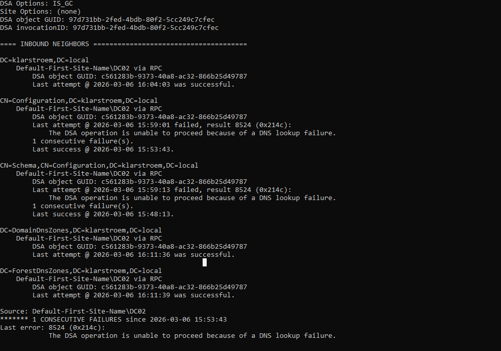
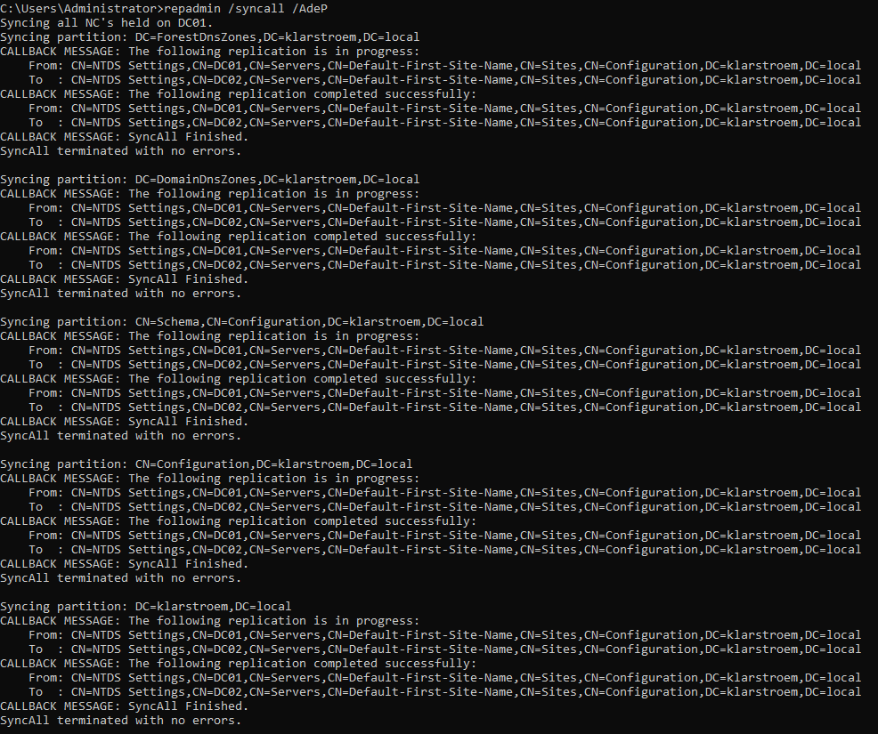

# Active Directory replication between domain controllers

## Overview  
In this lab we will look at how replication works between domain controllers in an Active Directory environment. The goal is to verify that data is synchronized between controllers and to learn how to check replication health using built-in admin tools. Several common **repadmin** commands are used to test replication, review replication status, and understand the output provided by the system. 

## Objectives  
1. Verify replication between domain controllers.
2. Check replication health using repadmin tools.
3. Understand how to read replication command output.
4. Identify the five Active Directory naming contexts that replicate between domain controllers.

## Environment  
The environments consists of two domain controllers deployed in the klarstroem.local domain.

DC01: Primary controller  
DC02: Additional domain controller

Both servers run Windows Server and are configured on the same internal network using the Host-Only adapter. DNS services are installed on both controller, allowing domain services and replication to function across the environment. 

## Implementation

#### Active Directory naming context  
Before we dive into the different commands and the outputs, I think it would be very benifitial to understand how AD replicates data between domain controllers. AD does not replicate the entire directory as one block. The directory is divided into several **partitions** also called naming contexts. Each partition contains different types of data and is replicated seperately, there are five partitions "blocks":

**Domain Partition:**  
Contains objects within the domain such as users, groups, computers, and organizational units. This partition only replicates between domain controllers that belong to the same domain.

**Configuration Partition:**  
Contains configuration information settings for the entire AD forest. This includes sites, subnets, and replication topology settings. This partition replicates to all domain controllers in the forest.

**Schema Partition:**  
Defines the structure of objects stored in AD. it specifies which object types and attributes are allowed in the directory. The schema is the same across the entire forest and therefore it replicates to all domain controllers.

**DomainDnsZones Partition:**  
Containes DNS data related to the domain. This includes DNS records used by domain controllers and clients. The partition replicates to domain controllers running DNS services within the same domain. DNS records used inside the same domain.

**ForestDnsZones Partition:**  
Contains DNS information shared across the entire forest. This ensures that DNS records required across the forest are replicated between all DNS servers. DNS records needed anywhere in the forest, example communication between different domains within the forest.

#### Step 1: Replication health overview  
The command *repadmin /replsummary* gives a summary of replication attempts between domain controllers. It shows the last 5 replication attempts, replication delays, and overall replication health across the environment.

Largest delta = the time since the last successful replication  
Fails/total = shows how many replication has failed out of the last 5 attempts  
Error code = gives an indication to why the replication failed

In this example above, DC01 shows successful replication attempts with a very small replication delta, this indicates a healthy synchronization with its partner "DC02". DC02 shows two failed replication attempt with error 8524, this indicates DNS lookup failure. 

The command and the picture above shows that two out of time attempts failed and why does two failed. However, the command does not show when the failure occurred or which AD partition failed. This is where step two comes in.

#### Step 2: Inspect detailed replication information  
The *repadmin /showrepl* command shows detailed replication details for each of the 5 partitions. It shows last successful replication time, the last attempt, and any errors that occurred.

Using this command makes it possible to determine which partitions failed to replicate and when the failure occurred.

The detailed output shows that the failures occurred earlier due to a DNS lookup issue. We also see that the effected partitions are the configuration partition and the schema partition. Show lets concentrate on the configuration partition: 

The output shows that the last successful replication occurred at 15:53, while the most recent replication attempt at 15:59 failed.

This situation can occur when a domain controller is restarted. After start up, the system automatically tries to replicate with the other domain controllers. If supporting services such as DNS are not fully available yet, the replication attempt may fail.

Because of this, the replication commands shown so far only provide information about previous attempts. They do not confirm whether replication is currently working. For that reason, in next step will force replication in real time. This allows us to verify whether replication between the domain controllers works at this moment.

#### Step 3: Force replication between DC01 and DC02  
As mentioned, we're able to test replication in real time and by using the command *repadmin /syncall /AdeP* and thereby force replication. Before executing the command, i'd then like to give a short explanation to the command:

**syncall:** Tells the domain controller to synchronize to all its replication partners.

Now to the flags: **AdeP:**
A = means to include all naming contexts (partitions)  
d = identifies the replication partners by distinguished name in the output. This simply makes the output easier to read  
e = menas Enterprise - It tells the command to includce all replication partners across sites, not just partners in the same site. We only have one site "network" but in real enterprises they might have several networks/ subnets in different locations.  
P = means Push - Normally AD replication is pull based, meaning the destination DC quests updates. When we use P, the domain controller pushes the changes to its partners immediately. 

Lets go ahead and use the command to test if replication works at this exact time:  

The output shows that replication is for each AD partition (NC = Naming Context). For every partition, the system reports that replication completed successfully between DC01 and DC02.

At the end of each section the message "SyncAll terminated with no errors" confirms that synchronization finished successfully.

This verifies that replication between the domain controllers is functioning correctly.

## Verification

## Results

## Lessons Learned

## Next steps

