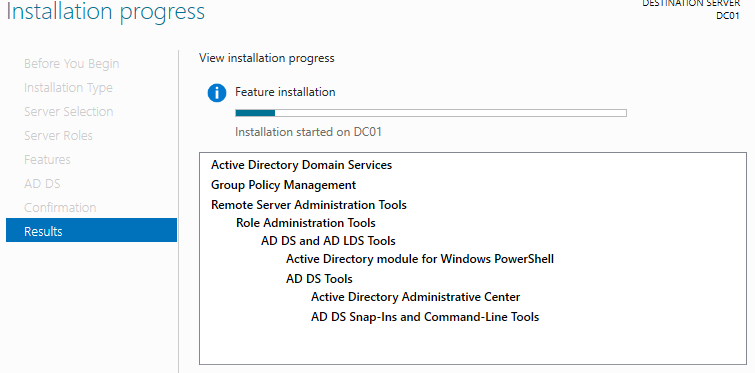
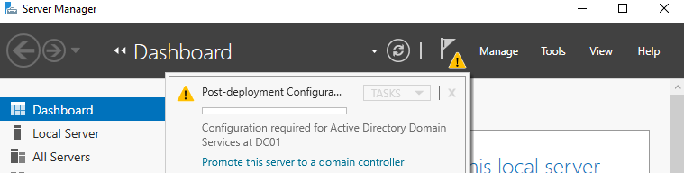
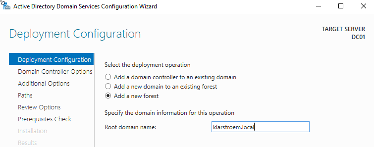
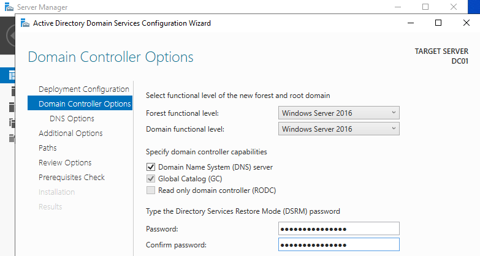
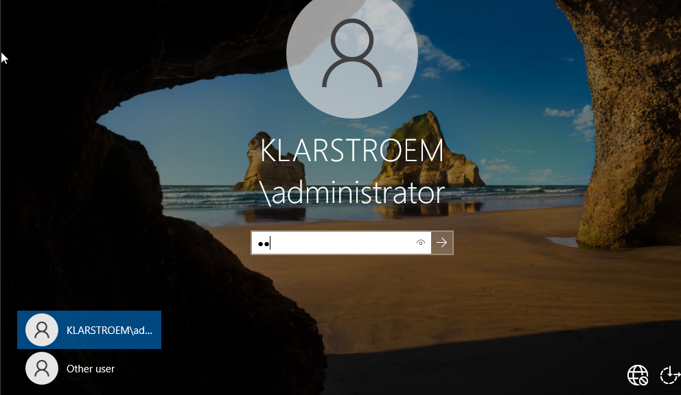
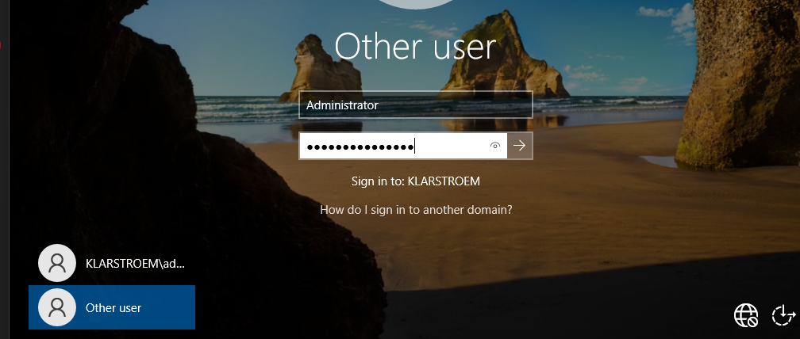
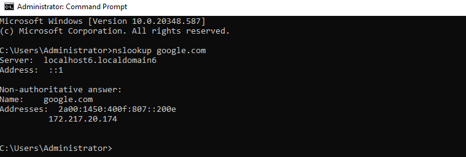

## Installing the AD DS role.
Installing AD DS role: 
- Server Manager -> Add roles and features.
  - Installation type: Role-based or feature-based installation.
  - Server selection:  DC01.
  - Server Roles: Active Directory Domain Services.
  - Features: Server Manager will automatically apply and auto select the features that are   required to run AD DS.
 

We do not have to check the role **DNS Server** from the menu at this point because during promotion "next step", Windows will automatically install and configure DNS because its required for a domain controller.

## Promote to Domain Controller.

We've installed AD DS, now we need to promote the server to be a domain controller.

Inside Server Manager a yellow triangle will appear saying; *Configuration required for Active Directory Domain Services at DC01* we then press Promote this server to a domain controller:

Inside the configuration wizzard there are mainly two very important sections we should be aware of.  

**1. The Deployment Configuration:**
   - Here the important part is to select the correct deployment operation. We haven't created a forrest priviously and therefore do not have a domain yet, so we chose **add a new forrest** and name our root domain: klarstroem.local:

This creates:
  - A new forest
  - A new domain
  - A new DNS namespace
   

**2. The Domain Controller options:**  

   - **Functional level:** The minimum Windows Server version allowed for domain controller in this forest, meaning all domain controllers must run Windows Server 2016 or newer.
   - **DNS Server:** It is automatically selected because Active Directory requires DNS
   - **Global Catalog:** Allows efficient authentication and forest-wide object searches. It stores nessesary information from other domains and a full copy of its own domain.
   - **Read-Only Domain Controller:** Used in branch offices where security is limited. The branch office wants:
     - Faster logins locally
     - Reduced WAN traffic
     - No full writable DC in this location
       
      Therefore they can deploy a RODC while head office in another country fully handles       the writable domain controllers.
   - **Directory Services Restore Mode:** This is a recovery password for maintenance and disaster recovery.

## Test promotion and configuration
 
**1.Test promotion to domain controller:**   
If we sign out or restart the VM we can now see that the primary authentication method has changed, the VM is no longer a member of a WorkGroup but instead the domain klarstroem.local:  
  

**2. Test DNS:**  
We simply want to test if the DNS Server role has been installed. I'm going to test both private DNS and Public DNS

Public DNS:  

Private DNS:  

