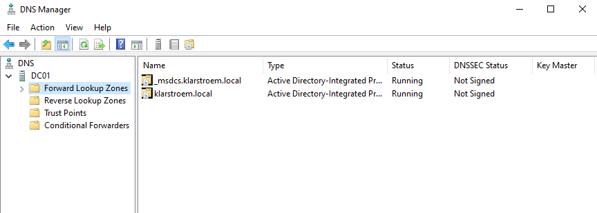
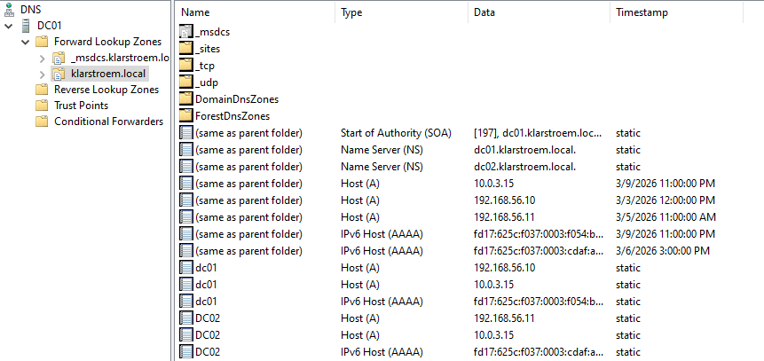
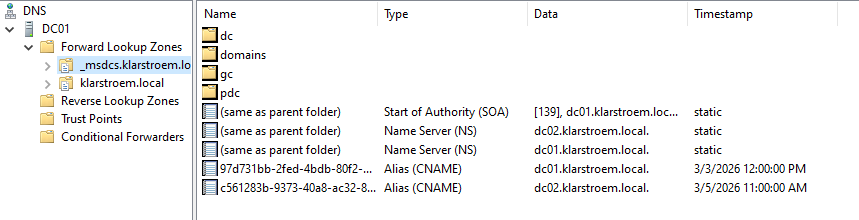
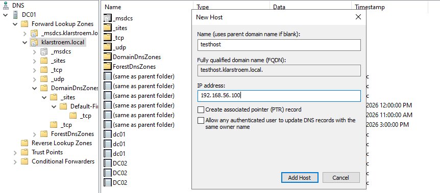
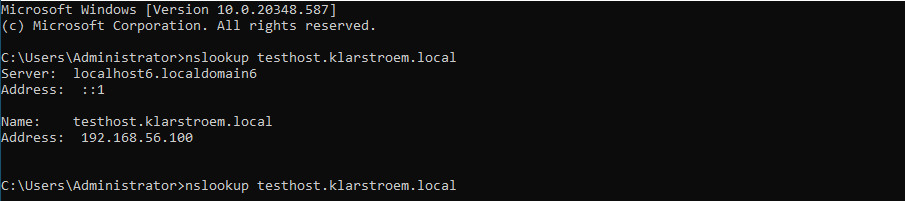
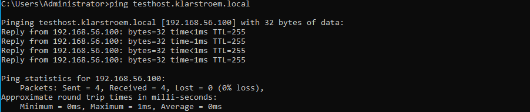

# Forward lookup zones

## Overview  
Forward lookup zones are used to resolve hostnames to IP addresses. In Active Directory, these zones store DNS records that allow clients and servers to locate resources and services in the network.

## Objectives  
- Explain the purpose of forward lookup zones
- Examine the zones created in the AD environment
- Identify common DNS records stored in these zones

## Environment  
Same environment as in the previous lab

## Implementation  

#### What are forward lookup zones  
These zones hold record types that resolve hostnames to IP addresses. Althrough many different record types exist in these zones common for most of them is that they map hostnames to IP addresses.

At first I had a hard time distinguishing the two forward lookup zones from each other, reason being mainly because SRV records exists in both. I learned that the answer different questions. klarstroem.local answers questions like: 
  - which servers provide LDAP for this domain
  - which servers provide Kerberos authentication

The _msdcs zone one the other hand is used for Active Directory infrastructure discovery. It answers questions like:
  - Which machines are domain controllers?
  - which servers are global catelog seervers
  - which DC own a particular directory object
  - Which DC should replication use

So the difference is **service discovery** vs **infrastructure discovery**

Common record types in forward lookup zones are:
- A records
- AAAA records
- SRV records
- CNAME records
- NS records

#### Examining the zones and records created in Active Directory  
We're able to find the DNS zones by opening DNS manager: Server manager -> Tools -> DNS  

In the above picture, we see the *forward lookup zone* folder/ container. Inside the container we see the two forward lookup zones *klarstroem.local* and *_msdcs.klarstroem.local*.

**The klarstroem.local zone:**  
This zone is the domain namespace, and is considered the primary DNS zone so it represents the actual domain. Records inside the zone describe hosts in the domain and services provided by the domain

On the above picture we see some of the different records in this zone. We've got several record types that maps our dc01 and dc02 domain controllers to IPv4 and IPv6 addresses. 

There are also additional folders inside of this domain:
- _sites folder: Used when the company has multiple Active Directory sites, meaning domain controllers in other networks/ locations.
  - Example: _ldap._tcp.siteA._sites.dc._msds.klarstroem.local
- _tcp folder: contains SRV records for services that use the TCP protocol which is most services.
- _udp folder: Contains SRV records for services that use UDP protocol. Some Kerberos and DNS services uses UDP for performance.
- DomainDnsZones folder: This ensures replication of DNS zones to all DNS servers in the domain.
- ForestDnsZones: This ensures replication of DNS data to all DNS servers in the entire forest.
- same as parent folder files: This means that these files belongs to root of the zone meaning klarstroem.local.

**The _msdcs.klarstroem.local zone:**  
This zone supports Active Directory infrastructure. It stores records used to locate domain controllers and other directory services. Many of the records inside this zone are SRV records that allows clients to locate domain controllers. I have chosen to dedicate a seperate lab to exactly this because of its importance within Active Directory.

#### How records are created in the forward lookup zones  
When recources join the domain, DNS records are dynamically registered in the primary domain zone. Infrastructure records required for locating domain controller are registered in the _msdcs zone by domain domain controllers and Active Directory services.

Forexample, if a server joins the domain that server will first be registered in the primary zone (klarstroem.local) and typical records such as A and AAAA records will be created. Later when we promote that server to a domain controller then SRV records will automatically be created in the _msdcs zone.

## Verification
We're going to do a simple test to show how hostnames are resolved to IP addresses. Therefore I am going to manually create a simple A record to show exactly this. In later labs im going to join client devices, and I will in those lab show that DNS records are dynamically registered.

#### Create a new A record in the forward lookup zone
To create a new A record: 
1. In the klarstroem.local zone right click, and choose New host (A or AAAA)
2. Give it a hostname: Testhost
3. Provide an IP-Address: 192.168.56.100

#### Verify DNS resolution
I will verify resolution by running nslookup, and then we'll see that the hostname is resolved to the specified IPv4 address. Also I of course used the Fully Qualified Domain Name: testhost.klarstroem.local

#### Testing using ping

## Results
The forward lookup zone klarstroem.local contains the DNS recvords used to resolve hostnames to IP addresses in the domain. I created a manual A record and verified that the DNS server was able to resolve the hostname correctly using nslookup and ping. This confirmed that the DNS server is functioning as expected and that records stored in the zone can be used by clients and servers in the environment.

## Lessons Learned
This lab helped me better understand how forward lookup zones are structured and how DNS records are stored within a domain. I saw how host records map machines to IP addresses and how DNS manager organizes types of records used by Active Directory.

I also learned that DNS in an Active Directory environment is not only used for basic hostname resolution. It also plays an important role in helping clients locate authentication services and other infrastructure services. Understanding how these records are stored in the zone makes it easier to troubleshoot DNS problems in the futuree.
