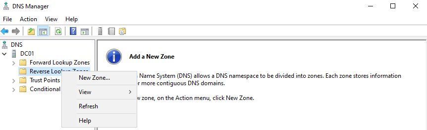
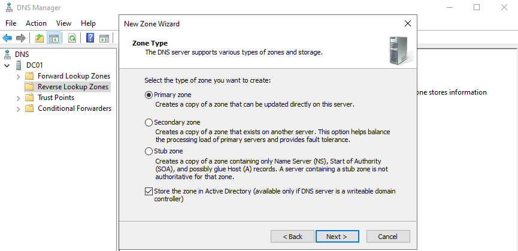
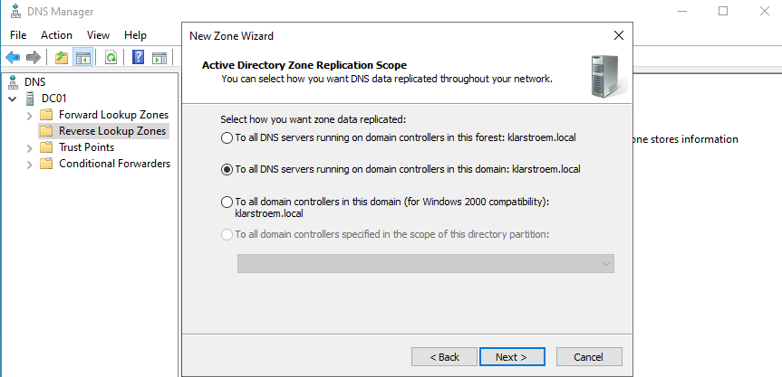
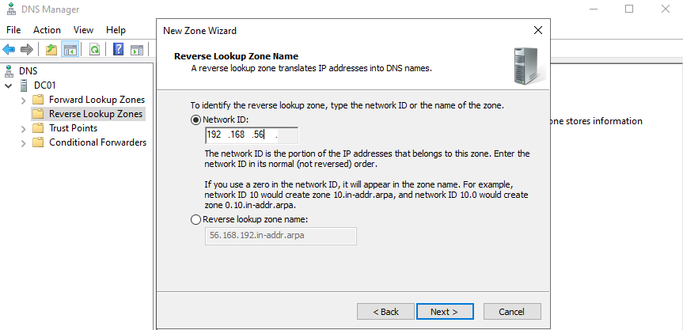
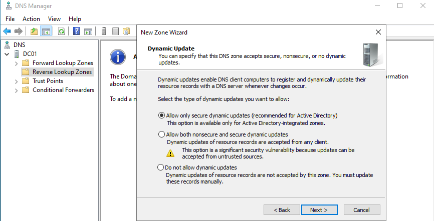

# Reverse lookup zone and PTR Records

## Overview
A reverse lookup zone allows DNS to resolves IP addresses back to hostnames. While forward lookup zones resolve Hostnames to IP addresses, reverse lookup zones perform the exact opposite function. This function is mostly used when analyzing logs, monitoring systems, or troubleshooting network activity where only IP addresses are visible.

In Active Directory, reverse lookup zones are considered a best practice because they allow admins and applications to easily identify which host corresponds to a given IP address.

## Objectives
- Understand the purpose of reserve lookup zones
- Understand PTR records
- Create a reverse lookup zone for my network
- Verify that IP addresses can be resolved to hostnames

## Environment
DC01:
- Windows server domain controller
- DNS Server role
DC02:
- Windows Server domain controller
- DNS Server role

Network: 192.168.56.0/24

## Implementation
#### Understanding reverse lookup zones
Reverse lookup zones resolve IP addresses to hostnames. This is the opposite of forward lookup zones, which resolves hostnames to IP addrsses.

Example of reverse lookup:
- 192.168.56.100 -> klarstroem.local.testuser

When installing the DNS server role to an Windows server, by default a reverse lookup zone is not created. Microsoft recommonds and says that best practice to is have have a reverse lookup some and have PTR records for all internal resources we manage. Reverse lookups are performed using PTR records.

#### Creating the reverse lookup zone
Before we can create PTR records, we then need a reverse lookup zone to store them in. We therefore need to create the reverse lookup zone first, and we do so in the DNS Manager.

In server manager there is already a default *Reverse Lookup Zones* forder, we need to create the zone itself by right clicking on the folder and choose *New Zone*:

Steps in the New Zone Wizard:

- **Choosing Zone Type:** first we're asked to select the type of zone we want to create. I have selected **Primary Zone** and **Store in Active Directory**. When we store a zone in AD it becomes an Active Directory Integrated zone, meaning:
  - The zone data is stored inside the AD database
  - Replication happens through AD replication
  - All DNS servers on domain controllers can update the zone
  - Even though I selected Primary, the result is actually multi-master DNS

- **Data replication:** next is to choose how we want zone data to be replicated, since we only host a single domain then i'll select *To all DNS servers running on domain controllers in this domain: klarstroem.local*. This means that The zone data is going to be replicated to DC01 and DC02 in our environment because both are DNS servers in the same domain. If we later create sub-domains, then zone data will still be replicated to those aswell because they're still in the same domain.  

- **IPv4 or IPv6:** we need to choose whether we want to resolve IPv4 or IPv6 addresses, I choose to create a IPv4 Reverse lookup Zone.

- **Network ID:** we have to provide the network ID: 192.168.56.X. The systems knows we're running a /24 network, and therefore the last octet is grayed out because it's the host portion and will be populated by hosts in the network when they register DNS data.

  Example of PTR records that will appear inside the zone:
  -  10 -> dc01.klarstroem.local
  - Full example: 10.56.168.192.in-addr.arpa -> dc01.klarstroem.local

  
- **Dynamic updates:** It asks us whether we want to allow dynamic updates to enable DNS client computers to register and dynamically update their resource records with the DNS servers, this is the recommended approch my Microsoft.

#### Dynamic PTR records registration

## Verification

## Results

## Lessons Learned
