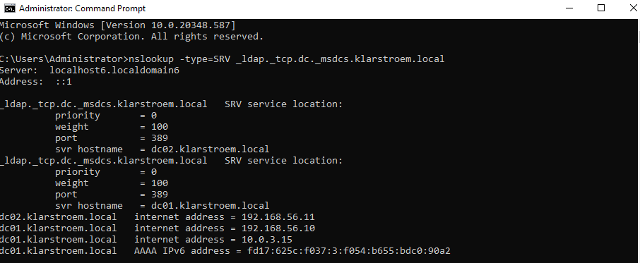

# SRV Records and AD Service discovery

## Overview
Active Directory relies on DNS to locate services within the environment/network. One of the most important DNS record types used in this process is the SRV record. SRV records ensures that clients and servers can locate services such as domain controllers, global gatelog servers, and Kerberos authentication services. Without SRV records, domain-joined computers would not be able to locate services required for authentication and other operations.

## Objectives
- Understand what SRV records are
- Understand how clients locate domain controllers
- Examine SRV records created by Active Directory
- Verify SRV record functionality using DNS queries

## Environment
DC01:
- Windows Server domain controller
- DNS Server role

DC02: 
- Windows Server domain controller
- DNS Server role

Network: 192.168.56.0/24

## Implementation
#### The concept of SRV records:
SRV stands for Service Record. These records allow clients to discover and locate services running on specific servers. Instead of connecting directly to a specific server, clients query DNS to locate a server that provides a particular requested service.

In Active Directory, SRV records are used to locate the following services:
- LDAP
- Kerberos: on-prem authentication protocal
- Global Catelog
- Domain controllers

The records for the above services are automatically created when a server is promoted to a domain controller. 

#### Location of SRV records:
SRV records are found in the forward lookup zones, more spcifically they are located in both _msdcs.klarstroem.local and klarstroem.local. Within these zones, the SRV records are organized into folders such as:
- _sites
- _tcp
- _udp

These folders categorize services based on protocol and site topology.

Examples of common SRV records:
- _ldap._tcp.dc._msdcs.klarstroem.local - Locate Domain Controllers
- _kerberos._tcp.klarstroem.local - Authentication
- _gc.tcp.klarstroem.local - Global Catelog

The above DNS queries/ records allow clients to locate domain controllers that provide these services

#### Active Directory service discovery process:
When a domain computer start and tries to log in, it must first locate a domain controller. The process follows these steps:
1. The client send a DNS query for an SRV record: _ldap._tcp.dc._msdcs.klarstroem.local
2. The DNS server responds with the available domain controllers that provide the LDAP service. Example response: dc01.klarstroem.local.
3. The client needs to resolve the hostname to an IP address and therefore uses an A record.
4. The client connects successfully to the domain controller to perform Kerberos authentication.
5. Client contacts the Kerberos Key Distribution Center (KDC) on the domain controller it has connected to. Kerberos runs on the domain controller and listens on port 88. So the client requets a Keberos ticket TGT "Ticket Granting Ticket"
6. If the provided credentials are correct, the domain controller issues the ticket. At this stage the client can request service tickets for other resources in the network such as application, file servers.

Once the client discovers a domain controller, it connects to that server directly. The same domain controller provides Kerberos authentication services, so the client does not have to perform another DNS lookup to locate a Kerberos server/service. The reason the Kerberos SRV records exist is for: 
- cross-domain authentication
- specific service discovery scenarios
- older Kerberos implementations.

## Verification
To verify SRV records, the following command can be used: *nslookup -type=SRV _ldap._tcp.dc._msdcs.klarstroem.local - This command asks DNS for SRV records that locate domain controllers for the domain.

First, let me breakdown the command.
- nslookup tool: stands for name server lookup, it is the tool used to query DNS servers and retrieve DNS records.
- -type=SRV: It tells nslookup which type of DNS record to search for
- _ldap: This specifies the service we are requesting
- _tcp: This specifies the transport protocol used by the service "ldap"
- dc: simply stands for domain controller, so the query is asking -> which servers provide ldap services for domain controllers?
- _msdcs: Microsoft Domain Controller Services, it specifies the zone used by AD to store infrastructure records required for locationg domain controllers.
- klarstroem.local: this is our domain.

So the whole command asks DNS: Which domain controllers provide LDAP services for the klarstroem.local domain?

We see that the query successfully returns both domain controllers. the priority and weight are for load balancing and redundancy, both have identical values so in our case the client choose either domain controller.

After DNS returned the hostnames for the domain controller, nslookup automatically resolves the hostnames using A records from the forward lookup zone.

In the privious lab about forward lookup zones, I briefly explain the difference between the two forward lookup zones msdcs.klarstroem.local and the klarstroem.local zone. I said that the msdcs is used to locate AD infrastructure and this is exactly what see see in this lab. 

The first DNS query a client sends when trying to logon is _ldap._tcp.dc._msdcs.klarstroem.local, this query is answered from the _msdcs.klarstroem.local zone. This zone contains the SRV records that identify domain controllers. The response is going to be hostnames, and then the client must resolve the hostname so it sends another DNS query, this time that query is answered from the primary forward lookup zone klarstroem.local because this zone holds A records.

## Results
The SRV records stored in DNS allow domain-joined devices to locate domain controllers and other services automatically. These records enable clients to dynamically discover available services instead of relying on static server configs. 

## Lessons Learned
This lab demonstrated how SRV records are used by Active Directory to locate services such as domain controllers and authentication services. Understanding SRV records and the process is important because they play a crucial role in domain logon, service discovery and other operations.

