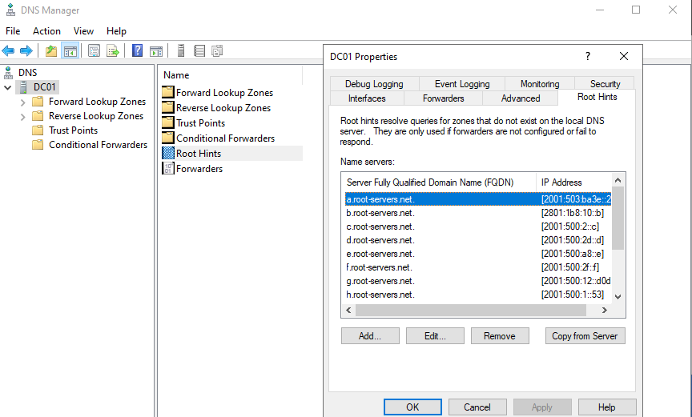
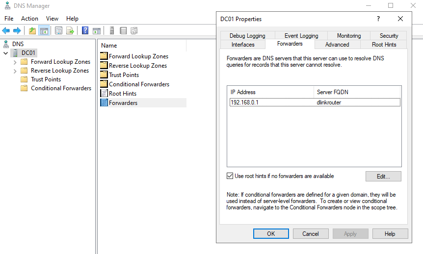
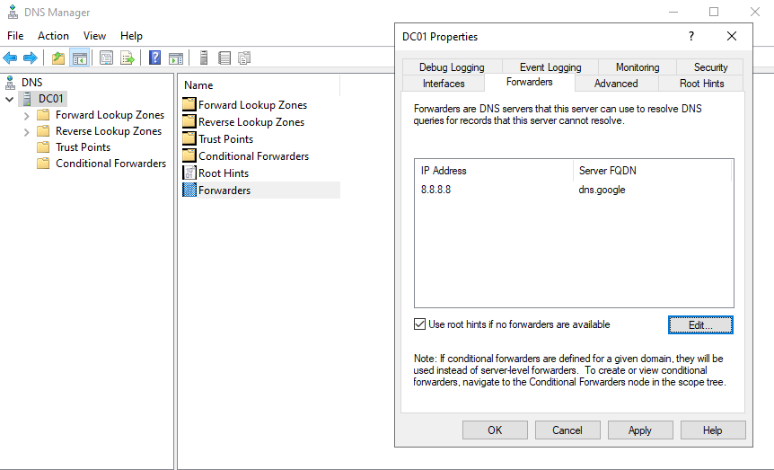
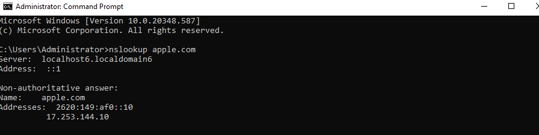

# DNS Forwarders and External Name Resolution

## Overview  
Internal DNS servers are responsible for resolving names within the organization's own network, such as domain controllers, servers, client machines, and other resources. Both users and systems still need to access resources on the internet, such as websites and cloud services. Internal DNS servers are not authoritative for public internet domains, they therefore rely on other DNS servers to resolve those queries.

DNS forwarders allow internal DNS servers to send queries to another DNS server to resolve queries that sits outside its own domain.

## Objectives
- Understand the purpose of DNS forwarders
- Understand how internal DNS servers resolve external domain names
- Configure DNS forwarders settings
- Verify that external domain names can be resolved through the DNS server

## Environment
Domain: klarstroem.local  
Network: 192.168.56.0/24

DC01:
- Windows Server domain controller
- DNS Server role

DC02:
- Windows Server domain controller
- DNS Server role

## Implementation
#### Concept of DNS forwarders:
DNS servers first tries to resolve queries using their own DNS zones and cached records. If the request cannot be resolved locally, the DNS server must forward the query externally.

**Forwarders** allow DNS servers to send unresolved queries to another DNS server, which then performs the lookup on behalf of the internal DNS server.

Forexample, when a client tries to access an external website, the internal DNS server checks its own zones. Since the resource/server does not exist in the internal network, the query is forwarded to the configued forwarder. The forwarder then resolves the request using the external/public DNS server it points to and then return the result to the internal DNS server, then the internal DNS server passes the response back to the client.

#### Forwarders vs Root Hints
If there is no forwarders configured, the DNS server will instead rely on root hints. Root hints contain a list of internet root DNS servers that allow the DNS server to follow the DNS hierarchy to resolve the request.

The additional paths the requests has to take going through several DNS servers complicates the process. For this reason it is best practice to configure forwarders to simplify the process.

#### Forwarder configuration
The DNS forwarder can be configured through DNS Manager: DNS Manager -> Server Properties -> Forwarders:

On the above we see that the DNS Server forwards unresolved queries to the local router at 192.168.0.1. The router then forwards the request to the ISP DNS servers to resolve the query.

I'm going to delete the current forwarder and replace it with google's DNS server. Also pay attention to the check box *use root hints if no forwarder is configured* This confirms the root hint section addressed earlier.

## Verification
To verify external DNS resolution, the following command was used: *nslookup apple.com*

The DNS server successfully resolved the external domain name by forwarding queries to the configured DNS server. This confirms that the forwarder configuration allows internal clients to access external resources through the internal DNS infrastructure.

## Results
The DNS server successfully resolved external domain names by forwarding queries to the configured upstream DNS server. This confirms that the forwarder configuration allows internal clients to access external resources.

## Lessons Learned
This lab showed how DNS forwarders allow internal DNS servers to resolve external domain names that are not part of the internal DNS zones. 
