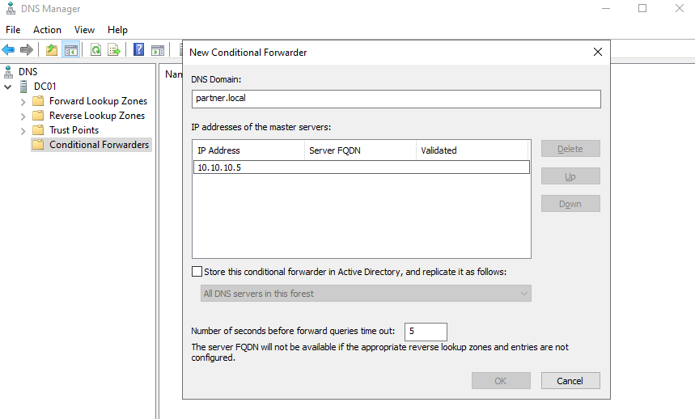

# Conditional Forwarders and Stub Zones

## Overview
Conditional forwarders ensures that a DNS server can forwward queries for a specific domain to a specific DNS server. Instead of performing full recursive resolution, the DNS server forwards the request directly to the DNS server responsible for that domain.

## Objectives
- Understand the purpose of conditional forwarders
- Understand the purpose of stub zones
- Understand how DNS servers resolve names across multiple DNS namespaces
- Compare conditional forwarders and stub zones
  
## Environment
Domain: klarstroem.local  
Network: 192.168.56.0/24

DC01:
- Windows Server domain controller
- DNS Server role
DC02:
- Windows Server domain controller
- DNS Server role

**NOTE:**
This lab only explains the concepts of conditional forwarders and stub zones. The current project/environment contains only one DNS domain, therefore these features are not configured.

## Implementation
**Prerequisites** for conditional forwarders. Before configuring a conditional forwarders, the DNS servers of the involved domains must be able to communicate with each other over the network. Conditional forwarders do not create this connectivity, they only instruct the DNS server where to send DNS queries once connectivity already exists. In many real-world organizations, connectivity between seperate internal networks is established using one of the following methods:
- Site-to-site VPN connection
- Private WAN or MPLS connections between internal networks
- Cloud networking connections such as Azure VPN Gateway or ExpressRoute

Example:  
Organization A:
- Domain: klarstroem.local
- DNS Server: 192.168.56.10

Organization B:
- Domain: partner.local
- DNS Server: 10.10.10.5

After a VPN or private network connection is established between the two networks, DNS servers from each environment can communiicate.

A conditional forwarder can then be configured so that queries for the domain partner.local are forwarded to the DNS server responsible for that domain:

#### Stub Zones:
Stub zones provide an alternative for resolving names in external DNS namespaces. A stub zone contains a limited subset of DNS records from another zone that allows DNS server to identify the authoritative DNS server for that domain.

Stub zones contain the following records:
- SOA record
- NS record
- A record (glue records)

Instead of manually defining the DNS server as in conditional forwarders, stub zones automatically learn which DNS server are authoritative for the other domain. This ensures that the DNS server can dynamically learn and maintain correct information of the authoritative DNS infrastructure for that zone.

## Verification
Because the my environment only contains a single domain, conditional forwarders and stub zones were not configured. In a multi-domain environment, verification would involve testing name resolution between domains.

## Results
This lab gave an good understanding and overview of the two concepts. Both conditional forwarders and stubzones allow DNS servers to forward requets to the correct DNS infrastructure responsible for another domain.

## Lessons Learned
This lab showed how DNS servers can resolve names outside their own domain using conditional forwarders and stub zones. While both achieve similar golas, conditional forwarders rely on manual configuration while stub zones provide a more dynamic mechanism for discovering authoritative DNS servers.
