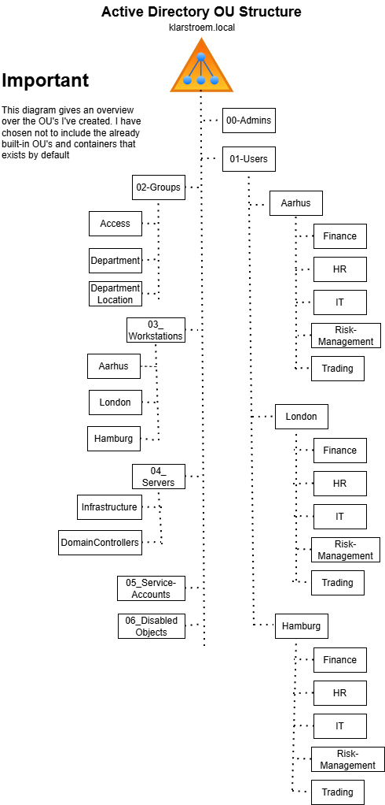
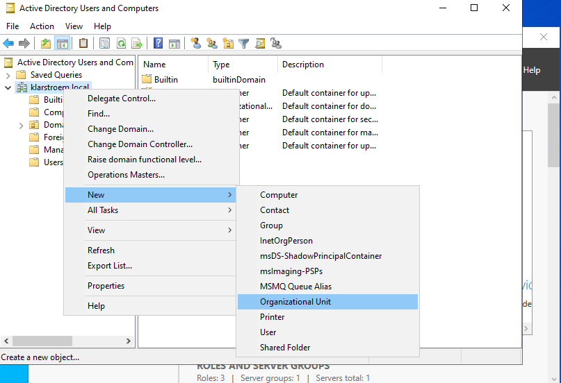
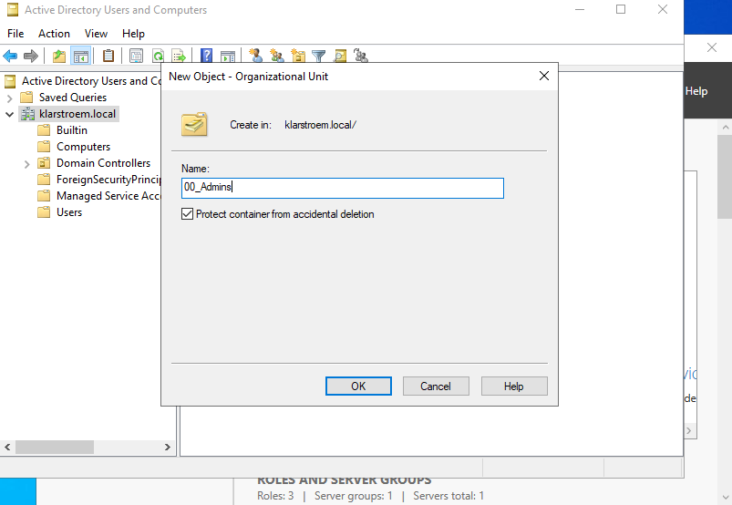
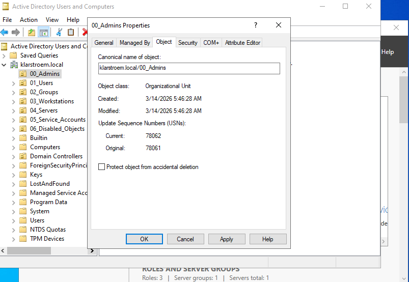
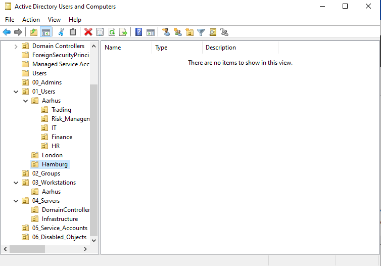

# Organizational Unit Architecture and Design

## Overview
Organizational Units are containers in Active Directory used to organize objects such as users, computers, groups, and service accounts/applications. Organizational Units provide a structured way to manage objectives within a domain.

OUs have two main administrative functions. They allow admins to apply Group Policies to specific sets of objects and they allow delegation of administrative tasks without giving domain-wide privileges. A common design approch is to organize OUs by object type first and then location or department. This simplifies Group Policy inheritance and administrative delegation. Group policies can be applied on both top-level domain scope "klarstroem.local" or at OU-Level scope.

In this lab the OU architecture is designed and implemented for the klarstroem domain. The structure reflects how many organizations seperate users, groups, workstations and servers to maintain clear boundaries.

**OU Design**  

## Objectives
- Understand the purpose of Organizational Units in Active Directory
- Design a scalable OU structure for Klarstroem
- Implement the OU hierarchy for Klarstroem
- Preopare the environment for identity management and Group Policy

## Environment
Domain: klarstroem.local  
Network: 192.168.56.0/24

DC01:
- Windows Server domain controller
- DNS Server role
  
DC01:
- Windows Server domain controller
- DNS Server role

## Implementation
#### Creating the top-level OUs/ Root OUs
First, I'm going to create the top-level organizational units:
1. Server Manager -> Tool -> AD Users and Computers:
2. Right click on the klarstroem.local domain
3. NEW -> Organizational Unit

Next, I'll type the new name of the first new top-level Organizational Unit "00_Admins". I also ensure the *Protect container from accidental deletion* is checked, this ensures the OU cannot be deleted by accident.

NOTE: If for any reason we would want to delete an OU that had the *Protect container from accidental deletion* option checked, we would then have to:
1. Enable advanced features under View at the top of the window
2. Right click on the OU we want to delete -> Properties
3. Choose the object tab -> Uncheck *Protect container from accidental deletion*
4. Now we would be able to delete the OU.

After I created the first OU 00_Admins, I then went ahead and created the rest top-level OUs: 
- 00_Admins
- 01_Users
- 02_Groups
- 03_Workstations
- 04_Servers
- 05_Server_Accounts
- 06_Disabled_Objects

These OUs seperate the major object types used in the environment. This seperation improves administrative control and simplifies the application of Group Policy which will be demonstrated in the next lab.

#### Create the child OUs in the within the top-level OUs

01_Users "Top Level OU"
- Child OU: Aarhus "Child OU"
  - Trading "Child OU"
  - Risk_Management "Child OU"
  - IT "Child OU"
  - Finance "Child OU"
  - HR "Child OU"     

This structure reflects how users are often organized within departments in real organizations. In a real organization we would normally have more locations than just Aarhus, but this is just for the project to show how it could be structured.

I went ahead and created additional child OUs under the top-level OUs already created. Once again this isn't the final design and architecture, this is the starting point so I can move forward in my project. I might create additional child OUs as i move forward with my project, but for now this shows how Organizational Units can be structured.

## Verification
This screenshots shows that I have created the top-level OUs and within the Top-level OUs I have created the child OUs. One again i'm probably going to add to the design as the project moves forward.

## Results
The domain now contains a structured OU hierarchy that seperates users, groups, devices, and servers. This design prepares the project for future administrative tasks such as identity lifecycle management, policy enforcement, and access control.

## Lessons Learned
Designing and OU architecture is an important early step when deploying Active Directory. A well designed OU architecture simplifies management, policy enforcement, and administrative delegation.

Seperating objects by type provides flixibility when applying Group Policy and managing different objects such as users, workstations, and servers.

For this lab only the Aarhus headquarters structure is implemented. Still the OU design allows additional locations to be added in the future without restructing the domain.

