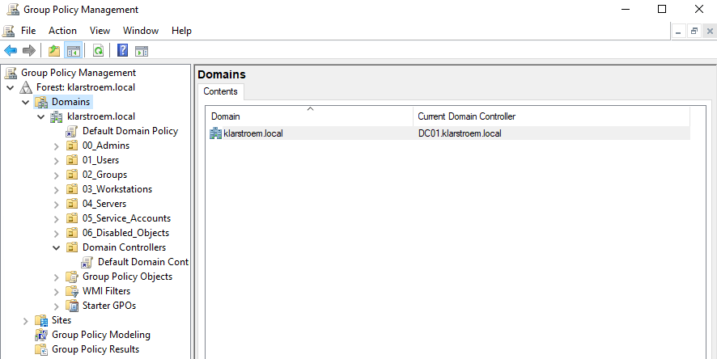
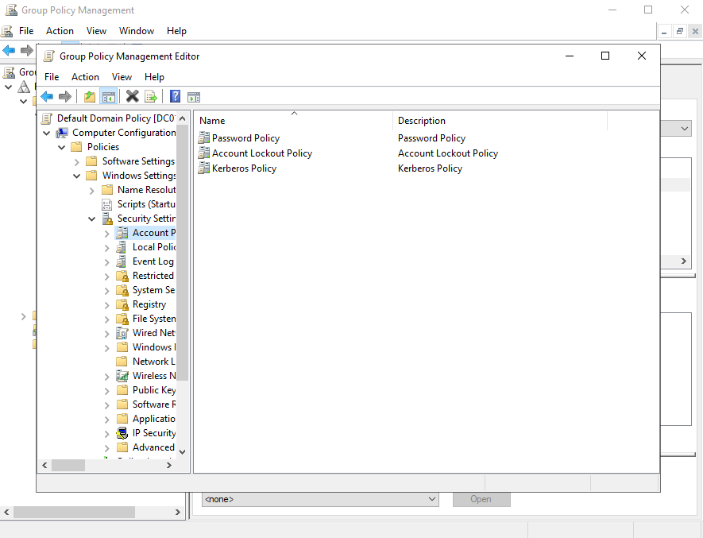
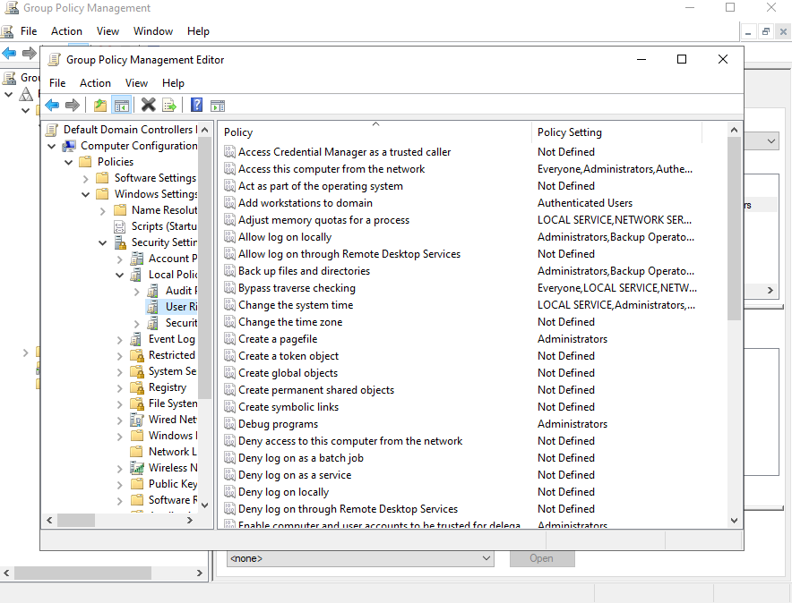

# Domain-Level Group Policy

## Overview
When an Active Directory domain is created, two default Group Policy Objects are automatically generated. These policies provide the basic security configuration for the domain environment. They are called the **Default Domain Policy** and the **Default Domain controller Policy.**

The Default domain policy typically contains domain-wide security settings that apply to all objects in the domain. These settings include password requirements, account lookout rules, and Kerberos authentication settings. Because these settings affect the entire domain, they are usually managed at the domain level instead of inside individual Organizational Units.

The Default Domain Controller Policy applies specifically to domain controllers. Domain controllers are the most critical systems in an AD environment because they store the directory database and handle authentication requests. For that reason, this policy focuses on security settings such as auditing and user rights assignments.

In many organizations they avoid making too many changes directly inside the default policies. Instead they create additional Group Policy Objects and link them to OUs.

The purpose of this lab is to show these default policies, understand where they are located, and review the types of security settings that are configured at the domain level.

## Objectives
- Understand the role of domain-level Group Policies in AD
- Locate the default policies that are automatically created
- Explore domain-wide settings

## Environment
Domain: klarstroem.local  
Network: 192.168.56.0/24

DC01:
- Windows Server domain controller
- DNS Server role
  
DC01:
- Windows Server domain controller
- DNS Server role
  
## Implementation
#### Locate the Default Group Policies
1. Open Server Manager -> Tools -> Group Policy Management
2. Expand the following: Forest -> klarstroem.local -> domains -> klarstroem.local
3. Under the domain klarstroem.local we see the two default policies **Default Domain Policy** and **Default Domain Controller Policy**

These policies were automatically created when the domain was deployed.

#### Explore the default Domain Policy

To explore the Default Domain Policy we right click on it and choose edit. Navigate to:
Computer Configuration -> Policies -> Windows Settings -> Security Settings -> Account Policies. 

In this section we'll see the main authentication settings for the domain:

Examples of password policy settings:
- Minimum password length
- Password complexity requirements
- Maximim password age
- Password history

#### Explore the Default Domain Controllers Policy
To explore the Default Domain Controllers Policy we right click on it and choose edit. Navigate to:
Computer Configuration -> Policies -> Windows Settings -> Local Policies -> User Rights Assignment. 

These settings define which accounts have privileges on domain controllers and control security auditing.

## Verification
We're not going to make any changes to the default policies, and therefore this section will remain empthy. In the next lab we're going to apply policies at OU-level. I just wanted to show where we could edit and configure these policies that would affect the whole domain at once.

It is also important to mention that if we configure a setting at the domain level and later configure the same setting in an OU-level GPO, the OU-level policy will generally take precedence because it is processed later. For example, if a domain-level GPO configures a desktop wallpaper and an OU-level GPO configures a different wallpaper, users within that OU will receive the OU-level configuration.

## Results
The domain contains the two default Group Policy Objects that provide the baseline security settings for the Active Directory environment.

The Default Domain Policy controls domain-wide authentication settings such as password rules and account lockout policies. The Default Domain Controller Policy focuces on protecting domain controllers by defining security permissions and auditing rules.

