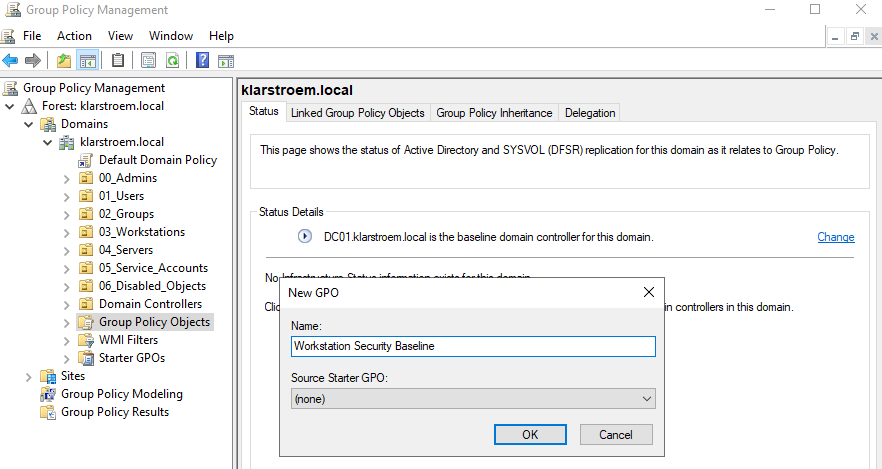
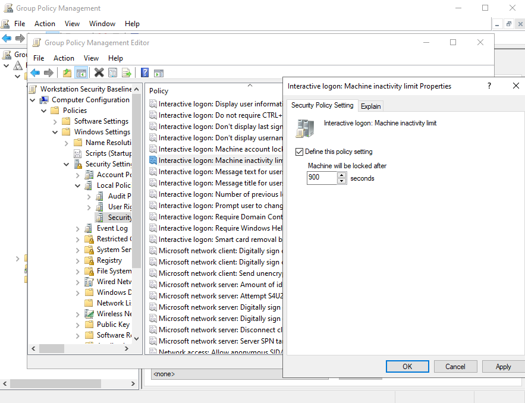
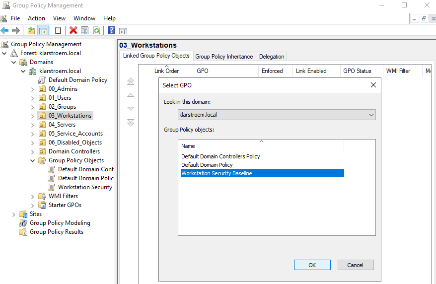
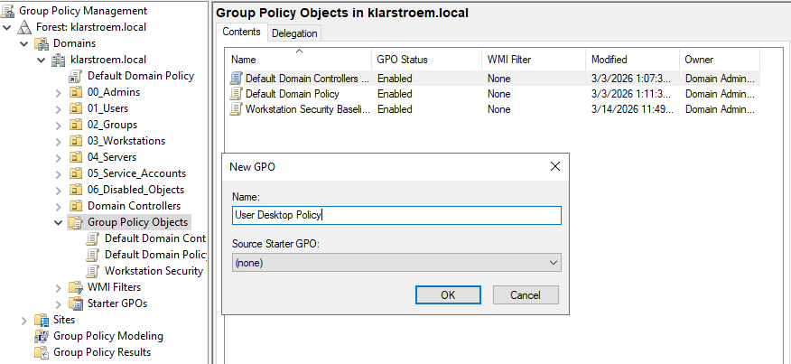
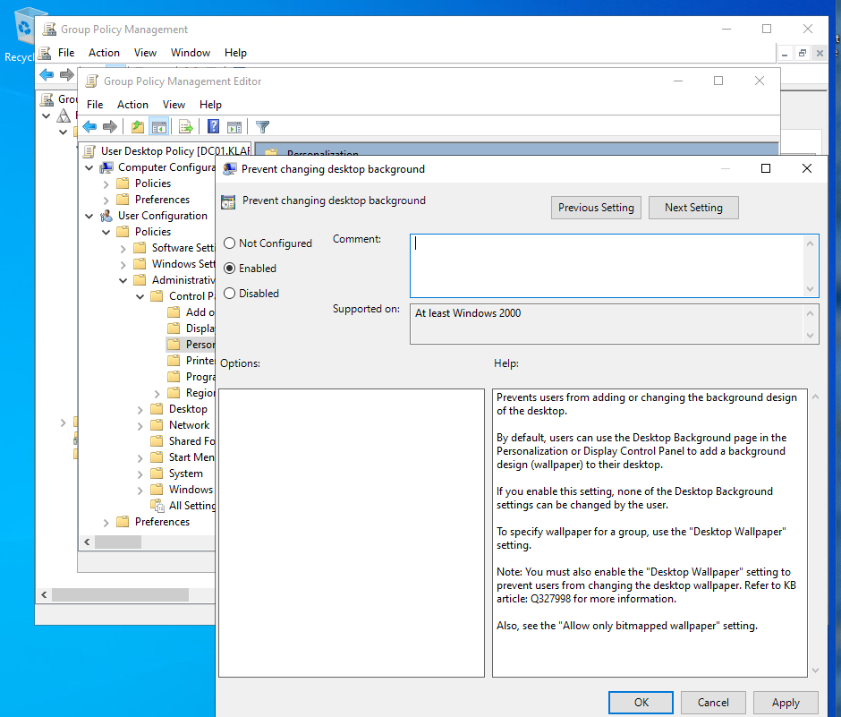
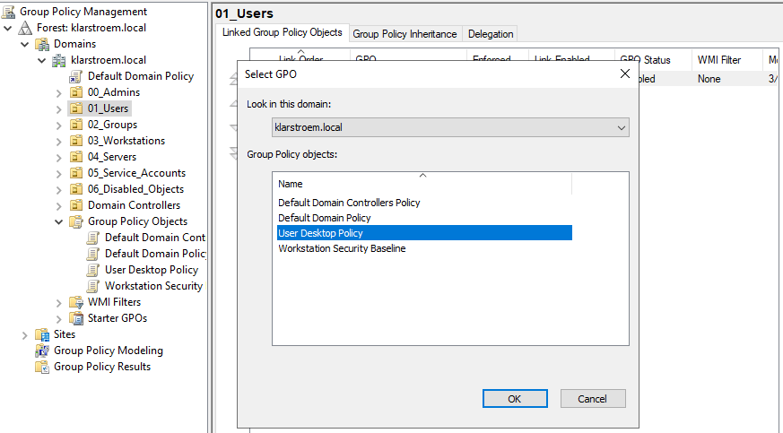

# OU-Level Group Policy implementation

## Overview
Group Policy Objects can be applied at different levels in an Active Directory environment. They can be configured on the local machine, at the site level, at the domain level, or at an Organizational Unit level. This order is described as Local, Site, Domain, and OU.

Policies that are applied further down this order will take priority over the ones applied earlier. This means that policies applied at an OU level can override settings that exist at the domain level. Because of this, most companies apply the most of their policies at the OU level. This allows admins to target specific users, workstations, or servers without affecting the entire domain.

In real organizations Group Policy is well thought off when enforcing security rules and system configurations. The number of available policies and settings is extremely large and organizations often spend a long time designing and managing them.

For this project only a few examples will be configured. The purpose of this lab is not to build a full enterprise policy configuration og setup, but simply to demonstrate how Group Policy Objects are created, configured, and linked to Organizational Units. This lab builds on the OU structure created earlier and demonstrates how policies can be applied to specific parts of the directory structure.

## Objectives
- Understand how GPO can be linked to Organizational Units
- Demonstrate how policies applied at the OU level can override domain policies
- Create example policies targeting users and workstations
  
## Environment
Domain: klarstroem.local Network: 192.168.56.0/24

DC01:

Windows Server domain controller
DNS Server role
DC01:

Windows Server domain controller
DNS Server role

## Implementation
In this lab two simple GPO will be created and applied to the OU structure that was created in the previous lab. The goal is to demonstrate how policies can be configured and linked to OUs so they automatically apply to the objects inside those OUs.

The first policy will target workstation devices and enforce a simple security setting. The second policy will target accounts and modify a small user environment configuration. These examples are intentionally simple and are only meant to show how policies can be applied and managed within the directory.

####

**Step 1: Open Group Policy Management Console.**  
To begin configuring policies, the Group Policy Management tool must be opened. This management tool allows us to create, modify, and link Group Policy Objects.

- Open Server Manager -> Tools -> Group Policy Management
- Navigate to: Forest -> klarstroem.local -> Domains -> Klarstroem.local

**Step 2: Create new workstation policy.**
Before applying any settings, a new Group Policy Object must first be created. This object will later contain the workstation security configuration.

Right click on the *Group Policy Object*
- New
- Name policy: Workstation Security Baseline

**Step 3: Configure the workstation policy**
Once the object has been created "Workstation Security Baseline", the next is to define the settings that the policy will enforce. In this example a simple security configuration will be applied taht automatically locks a workstation after a perioed of inactivity.

Right click on the new policy and click edit.  
Navigate to: 
- Computer Configurations
- Policies
- Windows settings
- local policies
- security options

Then I found the **Interactive logon: Machine inactivity limit**
- configured the value to 900 seconds

This setting will automatically lock the workstation after 15 mins of inactivity.

**Step 4: Link the policy to the Workstations OU.**  
After configuring the policy it then must be linked to an Organizational Unit so it can apply to the correct objects.

Return to the Group Policy Management Console and navigate to:
- klarstroem.local -> 03_Workstation
- Right click on the OU and select link an Existing GPO
- Choose: Workstation Security Baseline

Now, all computers located inside the Workstation OU will receive this policy

#### Create a user configuration policy:
The next step is to create a second policy that targets user accounts. This policy will modify a small user environment setting to demonstrate how user policies can also be applied through OUs.

**Step 1.**  
Just as in the previous example, we first need to create the policy under User Group Object:

**Step 2. Enable Prevent changing desktop background**  
Now that the policy has been created, the next step is to define the configuration it will enforce. In this example the policy will prevent the user from changing their desktop background.

Right click on the policy and select *Edit*  
Navigate to: 
- User configuration
- Policies
- Administrative templates
- Control Panel
- Personalization

Locate the setting: Prevent changing desktop background -> Set policy to enabled:

**Step 3: Link the user policy to the Users OU**
The final step is to link the policy to the Organizational Unit containing the user accounts.

- Navigate to: klarstroem -> 01_Users
- Right click the OU and select Link to Existing GPO
- Choose User Desktop Policy

Now all users inside 01_Users will recieve this policy, and of course the child OUs within 01_Users will inherit the policy.

## Verification
At this stage of the project no users or client devices have been created or joined to the domain yet. Because of this it is not possible to fully verify the policies on a domain-joined system.

Still, the policies can be verified within the Group Policy Management Console. The Console confirms that the policies have been successfully created and linked to the correct OU.

Once domain joined workstations and user accounts are created later in the project, the policies will automatically apply to those objects through OU inheritance.

## Results
Two example GPO were successfully created and linked to the OU structure created earlier in the project.

The *Workstation Security Baseline* is linked to the Workstation OU and will apply to all devices located within that OU. The *User Desktop Policy* is linked to the Users OU and will apply to all users located in that OU and its child OUs.

## Lessons Learned
This lab demonstrates how GPO can be created and linked to OUs in order to enforce configuration settings within specific parts of the directory structure.

It also shows how policies applied at higher levels of the OU hierarchy automatically apply to child OUs through inheritance. This allows admins to enforce consistent configurations across multiple departments or locations without having to configure each one individually.

Once again, in real organizations many different policies would normally be implemented. In this project only a small number of example policies were created in order to demonstrate how OU level policy enforcement works.

**Note on Hybrid Identity:** The policies configured in this lab apply only to the on-premise environment. When users and devices are later synchronized to Entra ID using Entra Connect, these Group Policy settings are not automatically transferred to the cloud.

On-prem authentication is still handled by the domain controllers, which means these policies will still apply when users sign in to domain-joined computers. Cloud services such as Microsoft 365 use different ways for access control and configuration, such as conditional access and Intune policies.
