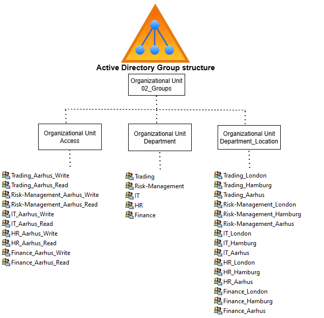
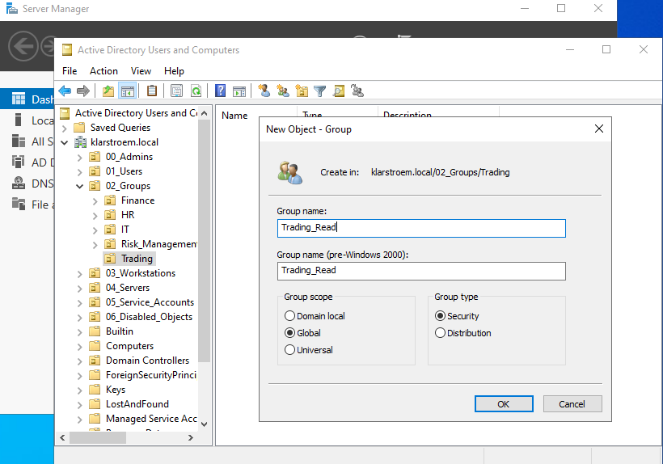
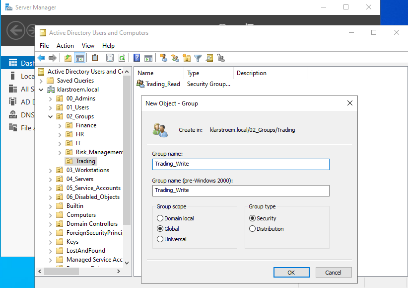

# Group Creation and Design

## Overview  
This lab describes the design and implementation of security groups in Active Directory. Groups are used to manage access to resources in a structured way. Instead of assigning permissions directly to users, permissions are assigned to groups, and users are added to those groups.

While I focus mainly on security groups, I should still mention that another group-type exists called destribution groups. The groups are used to send emails to multiple users at the same time. They are not used to assign permissions or access to resources.

## Objectives  
- Design a simple and scalable group structure
- Create security groups for access control
- Apply the principle of least privilege
- Avoid direct permission assignment to users
- Focus on one department for demonstration purposes

Scope for this lab:
The implementation focuses on the Trading department. The goal is to demonstrate the concept of group-based access control, not to build a full enterprise structure.

## Environment  

## Implementation  
#### Step 1. Organizational structure for groups
Before creating groups, a clear structure is structure is good practice to ensure scalability and ease of management.

In a previous lab I created several top-level OUs including **02_Groups**, This groups is going to be used to store all the required security groups within the environment.

Within this OU, additional child OUs are created to reflect business departments. This keeps groups organized and aligned with the organizational structure.

In this case, the following child OUs are created:
- Access
- Department
- Department_Location

**The purpose of the child OUs created**  
**Access child OU**
- This OU will contain groups that define the department and permission rights. These groups are mainly to control acess to on-premise resources. The read and write seperation might be a bit overkill but still it demonstrates good use of least-privledge.

**Department child OU**
- This OU will have groups that will hold users based on the department. This means, all users regardless of the physical location will be applied top the specific group.

 Example: Lets say we have two users called Alice and Maria, they both work in Trading but one is located in Aarhus the other in London, then both Alice and Maria will still be a part of the Trading group located within this OU.

 I created it this way because I simply wanted to have a group that will hold all employees in a specific department regardless of location. This can be helpfull later when groups are synchronized to Entra ID.

 **Deparment_Location child OU**  
 - This child OU have groups that holds users based on both department and location aswel. This will later become extremely usefull in a hybrid setup. Once synchronized to Entra ID it will make it alot easier for me to scope users by department and location when creating Administrative Units in Entra ID.

This approch ensures:
- Seperation of groups from users
- clear structure by department, permissions and location.
- easier management and delegation

#### Step 2. Group design strategy
Groups inside the Access OU are designed based on access requirements, not individuals.

Instead of creating groups for specific users, groups instead represent roles or levels of access within a department.

We're going to concentrate on the Trading department, and for the Trading department the following groups are defined:
- Trading_Read
- Trading_Write

#### Step 3. Group creation.
We going to create the groups within: 02_Groups -> Trading

Each Group is configured as:
- Type: Security
- Scope: Global

Groupe score determines where the group can be used and what it can contain.

**Global (used in this lab)**
- Members: users from the same domain
- Usage: can be assigned permissions within the domain and beyond
- Typical use: role-based groups

**Domain local**
- Members: users and from the same domain and trusted domains
- Usage: used to assign permissions to resources in its own domain
- Typical use: resource-based, such as access to a shared folder

**Universal**
- Members: users and groups from multiple domains
- Usage: can be used across domains
- Typical use: multi-domain environments

The reason I chose Glocal scope is because:
- all users are within a single domain
- it simplefies group management

I chose *security groups* because they are used to assign permissions to resources, *Distribution* on the other hand is used for exchange email purposes.

The naming of the groups uses the format -> <Department>_<AccessLevel>, therefore:
- Trading_Read
- Trading Write

#### Step 5. Preparation for access control
At this point, the groups do not yet enforce any permissions.

Their purpose is to act as containers for users. In later stages, these groups will be assigned permissions to resources such as shared folders.

## Verification
After creating the groups, I checked that they were placed in the correct location under 02_Groups -> Trading. I also confirmed that both groups were created as Security groups with Glocal scope. The naming was reviewed to make sure it followed the format I decided on, and I verified that the groups appear correctly in Users and Computers.

## Results
At this point, I now have a simple but structured set of groups for the Trading department. The groups reflect different access levels and are ready to be used when assigning users and later when configuring permissions on shared resources.

Groups that sits in the *Department* and *Departmøent_Location* OUs serves a different purpose as explained ealier. These will make management alot easier, especially later when we evolve to a hybrid environment.

## Lessons Learned
This step made it clear why groups are used instead of assigning permissions directly to users. It is much easier to manage access when everything is handled through groups. I also saw how important it is to keep a clean structure in AD, especially when seperating users and groups.

