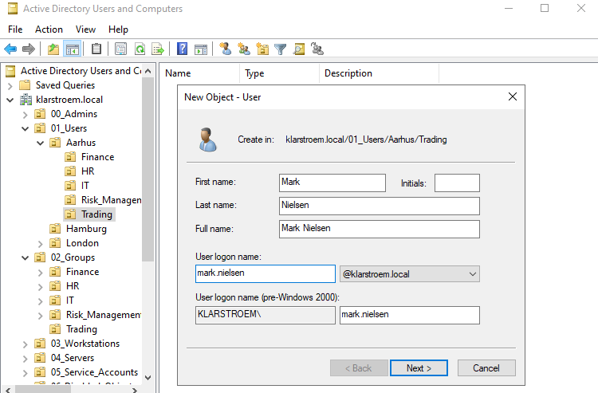
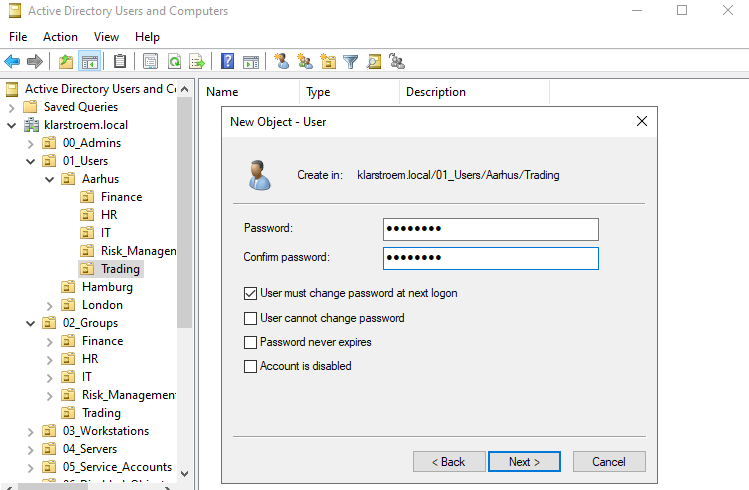
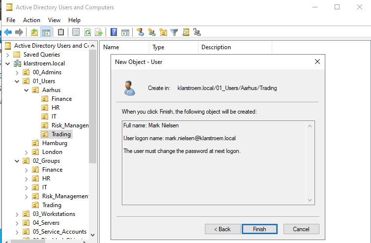

# User creation and user attributes.

## Overview  
In this lab, user accounts are created and configured. While creating a user is a simple task, the main focus is on properly configuring user attributes. These attributes define the identity of the user and are important for management, access control, and later synchronization to Microsoft Entra ID.

The lab builds on the previous step, where groups were created for the Trading department. The users created here will later be added to those groups and used to test access to resources.

## Objectives  
- Create user accounts in a structured way
- Configure relevant attributes to support identity management
- Show the importance of user attributes

## Implementation  
#### Step 1: User creation.
Users are created directly in the appropriate Organizational Unit to reflect the structure of the organization: 01_Users -> Aarhus -> Trading

For each user we have to provide: 
- First name
- Last name
- Full name "Is filled out automatically"
- User logon name: The UPN format for our organization is firstName.LastName@klarstroem.local

I'll start out with creating my first user, Mark Nielsen:

Next, I chose *User must change password at next logon*, this is a common approch in real organizations. I would then hand the user the temporary password, and then the user had to change the password when trying to logon for the first time. This ensures that no one other than the user knows the password to that account:

Here is the final output:

After I had successfully created the user Mark Nielsen, I then went ahead and created an additional user named **Line Hansen**

## Verification

## Results

## Lessons Learned
