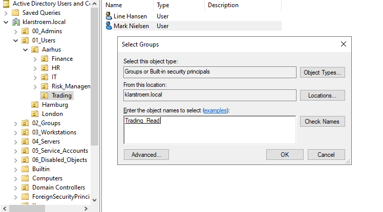
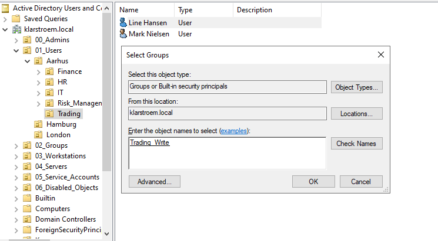

# Group Membership

## Overview  
In the previous labs, the required security groups were created for the Trading department, including Trading_Read and Trading_Write. User accounts were also created and placed in the correct Organizational Unit.

With both users and groups in place, the next step is to connect them. This is done by adding the users to the relevant groups. This step is important because users do not recieve access directly. Instead, access is managed through group membership.

## Objectives  

## Environment  

## Implementation  
#### Step 1. Identify users and groups
At this point we have the following:

Security Groups
- Trading_Read
- Trading_Write

Users created
- Mark Nielsen - Junior trader
- Line Hansen - Senior Trader

The following mapping is therefore going to be
- mark.nielsen -> Trading_Read
- line.hansen -> Trading_Write

This ensures that the users recieve different level of permissions based on their role.

#### Step 2. Add users to groups.
I've noticed that there are several ways to add users to the specific groups.

**Option 1 (used in this lab)**
Right-click on the user -> Add to group -> enter the group name

**Option 2**
Right-click on the user -> Properties -> Member of tab -> Add

**Option 3**
Right-click on the specific group -> Properties -> members tab -> Add

All methods achieve the same result. In this lab, the first option is used as it feels like the most logical to me.

- **mark.nielsen is added to Trading_Read:**
  

- **line.hansen is added to Trading_Write:**
  

## Verification

## Results

## Lessons Learned

## Next steps
