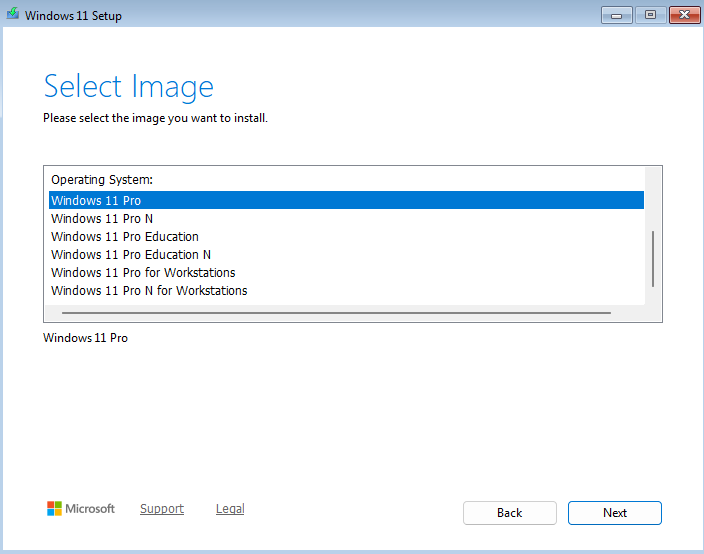
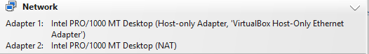
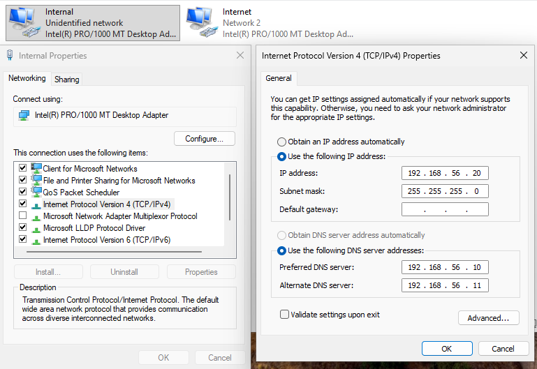
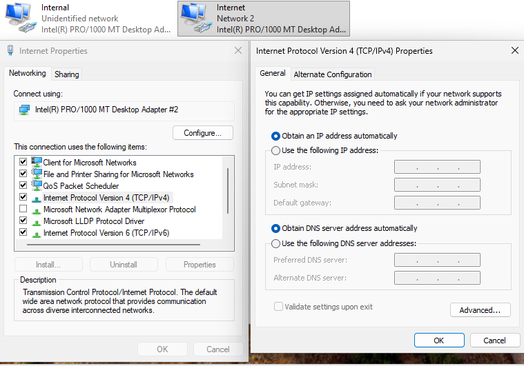
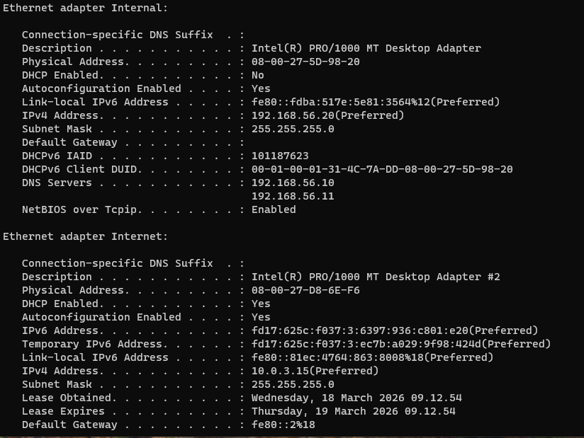
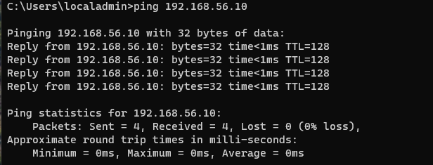
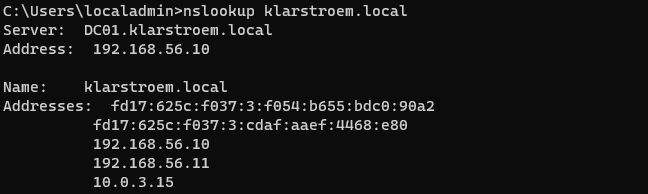
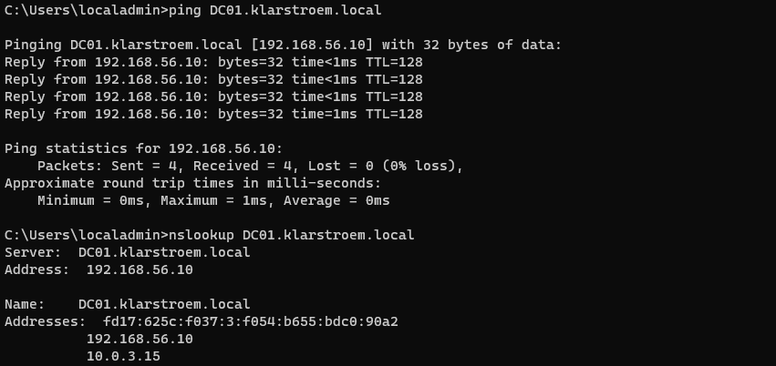

# Creating and configuring the client VM

## Overview
In this lab, a client VM is created and configured to prepare it to be domain joined. The goal is to establish a working client device that can communicate with the domain controllers and later be used to test authentication and access control.

The lab includes selecting the correct operating system, allocating recourses, and configuring networking to ensure connectivity within the environment.

## Objectives
- Create a client virtual machine for the lab environment
- Install a supported Windows operating system
- Allocate correct resources
- Configure networking to enable communication with domain controllers
- Prepare the device for formain join

## Environment
The following setup and environment is used:
- Hypervisor: VirtualBox
- Operating systems: Windows 11 Pro
- Domain: klarstroem.local

Virvial machine configuration:
- RAM: 4 GB
- CPR: 2 Processors
- Disk: 50 GB (dynamically allocated VDI)

## Implementation
#### Step 1. Creating the virtual machine
A new virtual machine is created in VirtualBox. During creation the following resources are assigned:
- 4 GB RAM
- 2 CPUs
- 50 GB dynamically allocated disk
  
I downloaded a Windows 11 ISO file, and during installation I made sure to choose Windows 11 **Pro** since other versions do not support domain-join capabilities:

#### Step 2. Configure networking
To ensure communication within the environment, the virtual machine is configured with two network adapters:
- Host-Only adapter: Used for internal communication "LAN"
- NAT adapter: Used to provide internet access "WAN"

I added these two adapter directly in VirtualBox by right clikking on the CLIENT01 -> Settings -> Network:

After the two adapters had been added, I then went and configured the network settings in the VM. 

**Internal network adapter "Host-Only"**

**Internet adapter "NAT"** is using DHCP, VirtualBox provides the necessary settings for external communication.
   

   
## Verification
To verify the configuration, the network settings were reviewed using the ipconfig /all command. This confirms that the correct IP addresses, subnet masks, and DNS settings are applied:

Connectivity to the domain controller was tested using a ping command with the domain controller's IP address:

DNS resolution was also tested using nslookup against the domain name, confirming that the client cloud resolve the domain through the configured DNS server:

I also pinged the domain controller using its fully qualified domain name "FQDN", which also succeeded. This confirms taht DNS resolution and name lookup works correctly:

## Results
The client virtual machine is now fully configured and able to communicate with the domain controllers. Network connectivity and DNS resolution are working as expected, and the system is prepared to be domain joined in the next lab.

## Lessons Learned
This step showed how important correct network configuration is in an Active Directory environment. Even if the system is installed correctly, domain join will fail if DNS is not configured right.

It also became clear that DNS plays a central role in AD, as it is used to locate the domain controllers and services. Simply having network connectivity is not enough wiothout proper name resolution.
