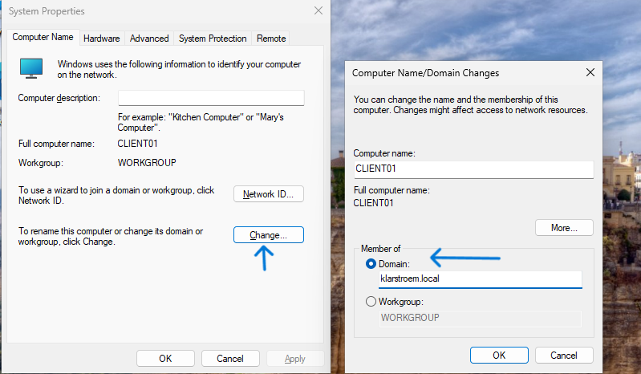
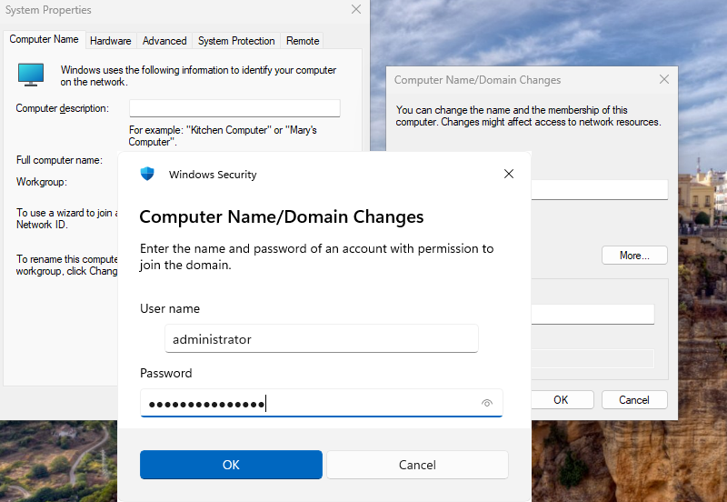
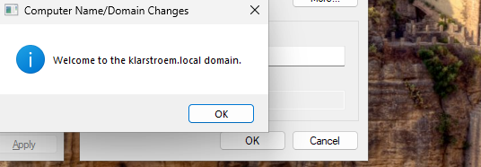
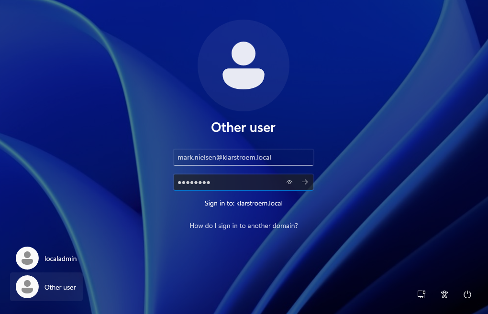
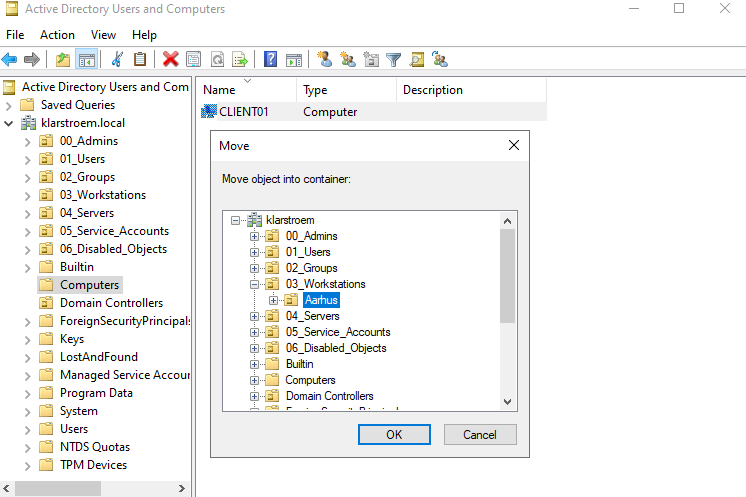

# Domain join of client device

## Overview
This lab focuses on joining a Windows 11 client machine "CLIENT01" to the Active Directory domain. The purpose is to move the device from a workgroup setup into a centrally managed environment "AD DS". This enables authentication through Active Directory and allows organization to apply policies, manage access, and control device from a single point.

## Objectives
- Join a Windows 11 client to the domain
- Verify domain membership
- Validate authentication using an existing domain user
- Confirm device registration in AD
- Move the client into the correct OU

## Environment
DC01:
- Domain controller
- Windows DNS server role
DC02:
- Domain controller
- Windows DNS server role

Client machine "CLIENT01": Windows 11 Pro
Network: 192.168.56.0/24

## Implementation
#### Step 1. Pre-configurations
In the previous lab I set up the VM and installed Windows 11 Pro. I configured the network setting ensuring the machine had an static IP within the internal network "Host-Only adapter". The DNS server was also configured to point to the domain controller to allow name resolution and domain discovery. 

Before the next step, I first ensured that the client PC could reach the domain controller:

#### Step 2. Join the client to the domain
To join the client to the domain, I opened the system properties using **sysdm.cpl**. Under the computer name tab, I changed the device from workgroup member to a domain by typing the domain name klarstroem.local:

I then had to provide domain administrator credentials to authorize the operation. After successful authentication, the system confirmed that the client had joined the domain and required a restart:

#### Logon using domain user
After reboot, the login screen allowed authentication using domain credentials. I now logged on to the client usinf the domain user Mark Nielsen:

#### 
On the domain controller, the device by default appears in the "Computers" container. The device was moved to the "Workstations" organizational unit to ensure structure and policy application:

## Verification

## Results

## Lessons Learned
