# Creating and configuring a dedicated file share volume

## Overview
In this lab, I'll create a dedicated drive on the server to seperate shared organizational data from the operating system drive. The purpose is to follow a more realistic server design where shared data is stored on a separate volume instead of the C drive. After creating the new volume, a shared folder is created and published through File and Storage Services in Server Manager. 

## Objectives
- Create a dedicated volume/drive for shared organizational data
- Create a root folder structure for shared resources
- Publish the folder as a network share through Server Manager
- Prepare the environment for later access control and permission configuration
  
## Environment
This lab is focused on the domain controller DC01. The server is running Windows Server and has the **File and Storage Services role** available in Server Manager. A client machine is already domain joined and will be used to validate access to the shared resource.

## Implementation
#### Step 1. Create a dedicated volume for shared data
The first step is to prepare dedicated storage for shared data. Instead of placing shared folders on the C drive directly, free space on the existing disk was reduced and used to create a new volume. On the DC01 Server I went into **Disk Management** where we'll se that we have almost 70 GB of free space on the C-Drive. Lets create a new Z-drive and allocate 10 gb from the C-drive to the new volume:
1. Right click on the C-Drive and choose Shrink volume
2. I'm going to free up almost 10 GB by specifying 10.000 MB
3. Then simply click shrink.
   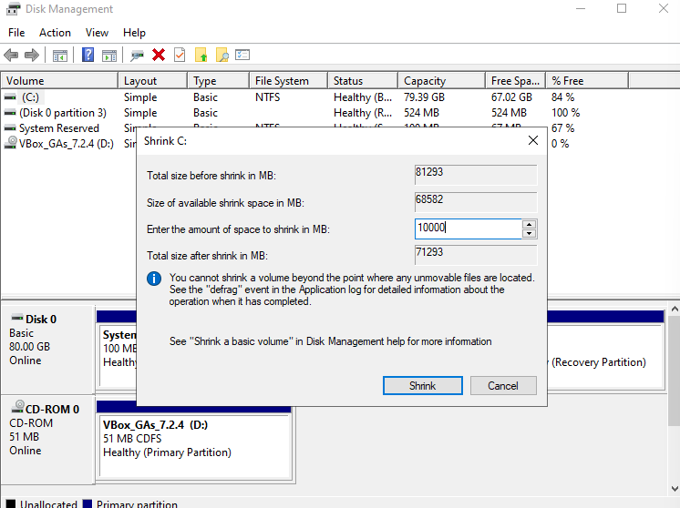

If we now take a closer look we can see that we have almost 10 GB of unallocated space:
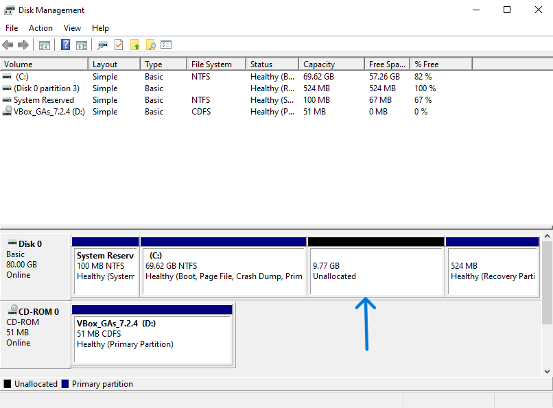

We simply right click on the **unallocated space** and choose **new simple volume**. This takes us to the New Simple Volume Wizard:
1. Specify Volume Size: 9999 MB
2. Asssign drive letter: Z-Drive
3. Format Partition:
  - File system = NTFS
  - Allocation unit size = Default
  - Volume label = Shares'

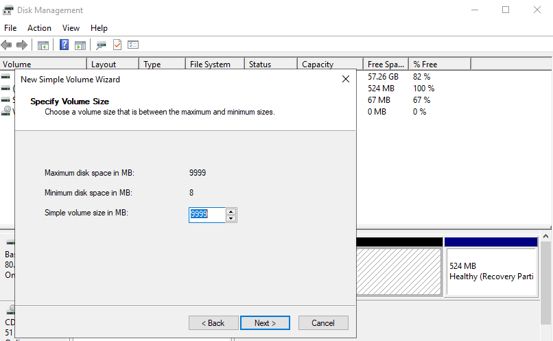
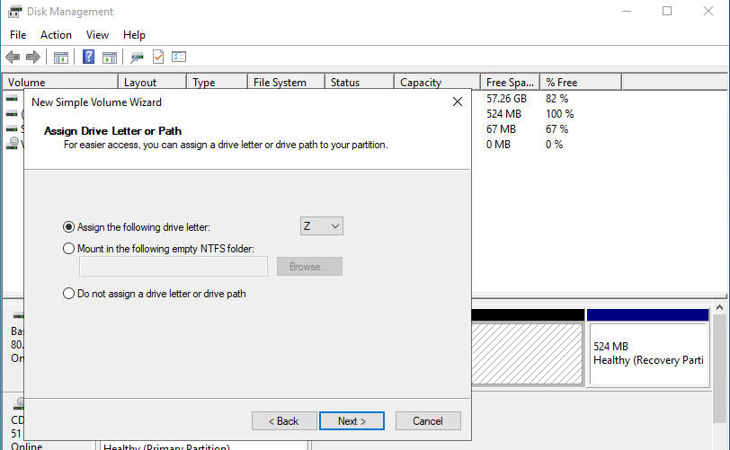
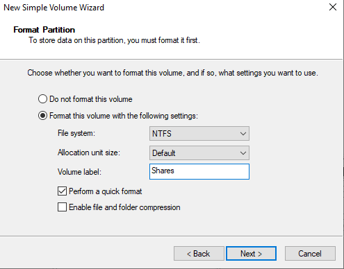

The new drive was formatted using NTFS, since NTFS supports the permission model required for enterprise file sharing, including access control, inheritance, and auditing.

At this point the drive has been successfully created.

#### Step 2. Create the root folder structure.
After the Z drive and Shares volume was created, the next step was to configure a network share from that volume through Server Manager.

This was done by opening Server Manager and navigating to:
File and Storage services -> Volumes -> Disks

From here, the newly created volume was located and right-clicked, and the New Share option was selected. This opened the New Share Wizard, which was then used to configure the shared folder directly from the dedicated storage volume:
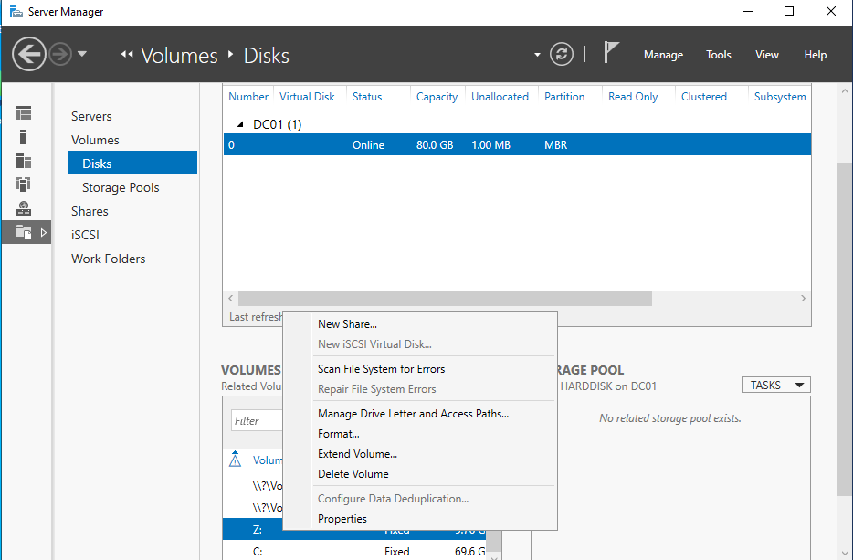

#### Step 3. Select the share profile and storage volume
Inside the New Share Wizard, the SMB share - Quick profile was selected. This profile is for standard Windows file sharing and is suitable for general organizational file share, the description of the different options are shown to the right:
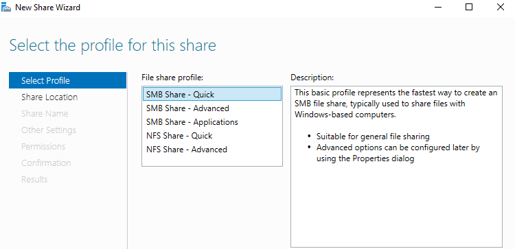

After selecting the share profile, the share location was configured on the dedicated Z: volume. At this point, the wizard was pointing to the Z: drive as the storage location for the new share. The purpose is to ensure that the shared data will be stored on the dedicated data volume rather than on the system drive.
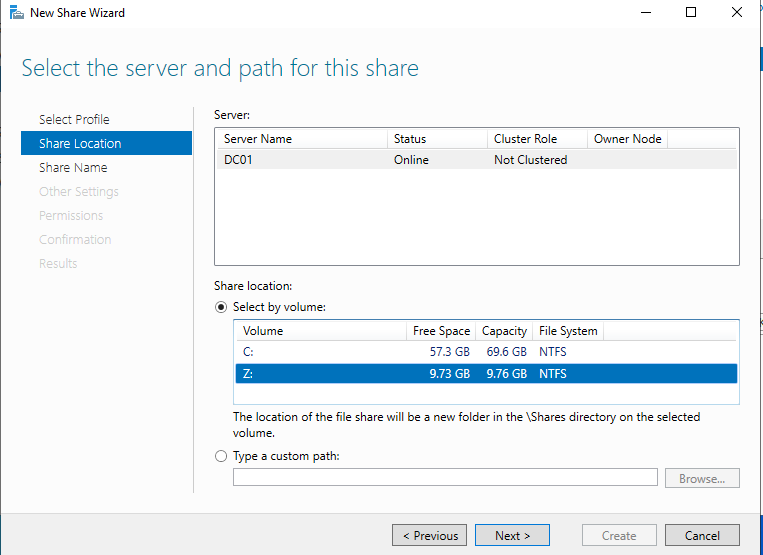

#### Define the share name and network path
After the path had been specified, the share was assigned the name: SharedNetworkFolders, this resulted in the following path: **Z:\Shares\SharedNetworkFolders**
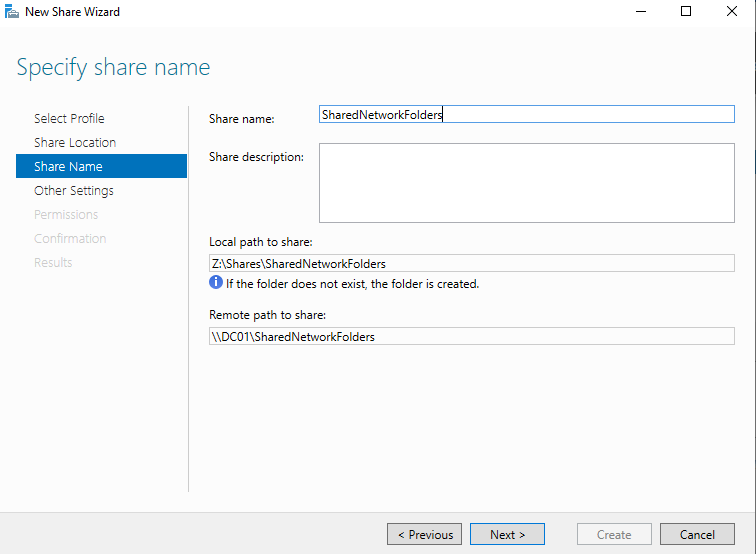

## Verification
First, the local path was verified on the domain controller by opening File Explorer and navigating to the Z-drive: **Z:\Shares\SharedNetworkFolders**:
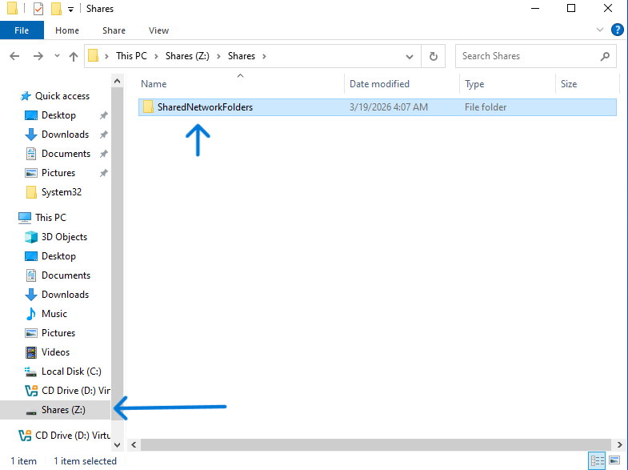
Additional verification using cmd:
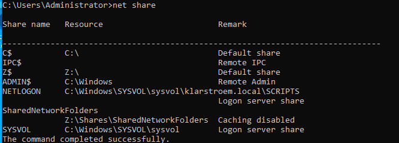
Remote access was also tested from a domain-joined client machine using a standard user account. From the client, File Explorer was opened and the server DC01 was chosen through the network. The share SharedNetworkFolders was visible and accessible, confirming that the network share had been successfully created:
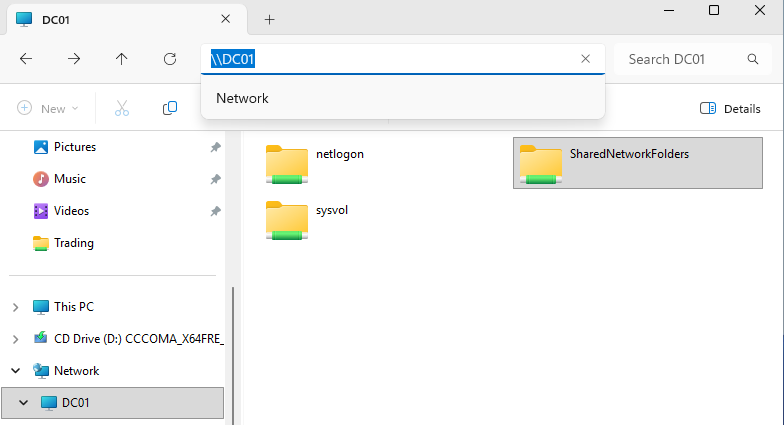

## Results
A dedicated volume for file sharing was successfully created and configured on the server. The Z drive was established and used to store shared organizational data separately from the system drive.

A centralized network share named SharedNetworkFolders was created and linked to the local path. The share was successfully published and made accessible over the network.

## Lessons Learned
During the setup, the shared resources could not be located from the client machine, even though connectivity test such as ping and DNS resolution were working correctly. This demonstrated that network connectivity alone is not sufficient to ensure access to shared resources. The issue was related to the active network profile and its settings.

The showed the importance of verifying which network profile is active on both the server and the client. Windows chooses between domain, private and public profiles, each with different security settings. In this case, incorrect settings within the active profile prevented visibility and access to shared resources.

Another key takeaway is that network discovery is not required for accessing shared resources directly. While enabling network discovery can make servers visible in the Network view, reliable access should always be tested using the direct paths.

I know hosting file shares directly on a domain controller is not considered best practice in production. In a real organization, file services would typically be hosted on dedicated file servers to ensure seperation of roles, improved security, and better scalability. In this lab, the domain controller was used for file sharing just for demonstration purposes.
