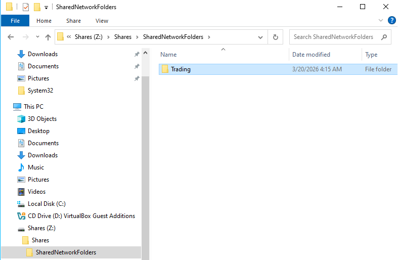
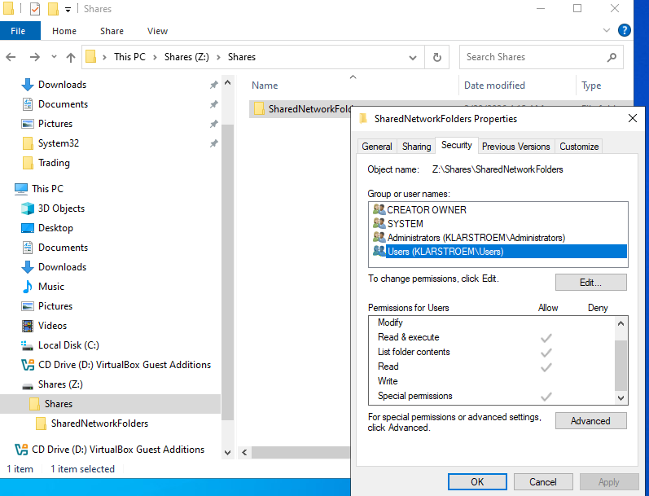
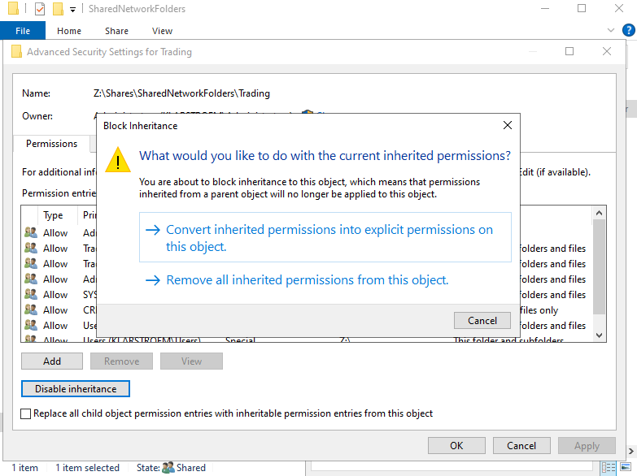
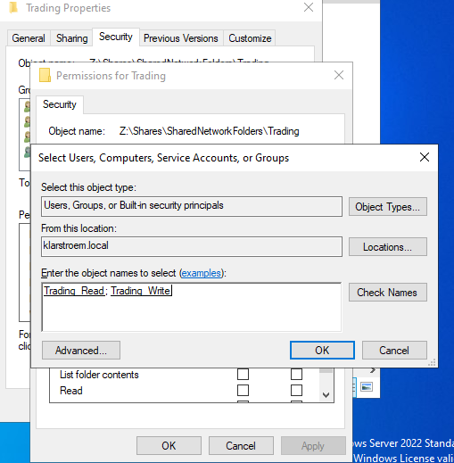
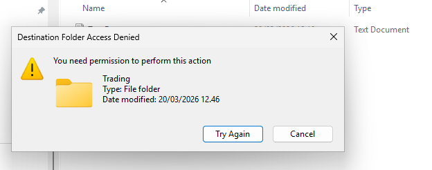
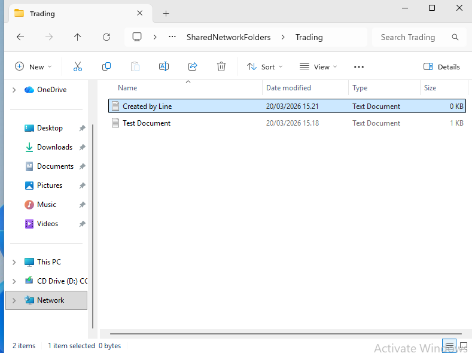
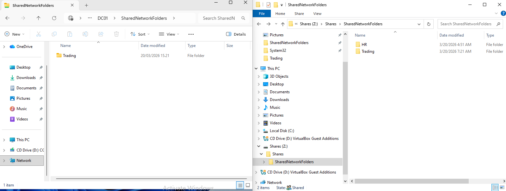

# Department folders, Security Groups, NTFS Permissions, and Access Based Enumeration

## Overview
This lab builds on lab 1 by expanding the file share into a structured file storage model within the domain. The goal is to create a realistic enterprise-style folder hierarchy, assign access through security groups, apply NTFS permissions based on least privlege, and enebale Access-Based Enumeration so users only see folders they are allowed access to.

## Objectives
- Create a department-based folder structure inside the shared volume
- Assign NTFS permissions based on group membership
- Apply the principle of least privlege to shared folder access
- Enable Access-Based Enumeration on the shared folder
- Verify that users only access and view folders they are authorized to use

## Environment
Domain: klarstroem.local  
Domain controllers: DC01 &DC02

Shared storage:
- Share name: \DC01\SharedNetworkFolders
- Local path: Z:\Shares\SharedNetworkFolders

## Implementation
#### Step 1. Create the department folder structure
Inside the existing folder path Z:\Shares\SharedNetworkFolders, a separete folder was created the Trading department

Structure: Z:\Shares\SharedNetworkFolders\Trading:

This folder represents the Trading department and will be used to demonstrate role-based access using existing groups created earlier

#### Step 2. Use existing Active Directory structure
Instead of creating new groups, the lab uses the already created structure in Active Directory.

Organizational Units:
- OU: 02_Groups
- Child OU: Trading

Existing security groups:
- Trading_Read
- Trading Write

Existing users:
- Mark Nielsen, member of Trading_Read
- Line Hansen, member of Trading_Write

This shows a realistic setup where identity objects are already provisioned and access control is applied afterward

#### Step 2. Understand Default NTFS inheritance
When the Trading folder was created, it automatically inherited permissions from its parent folder: Z:\Shares\SharedNetworkFolders

Inherited entities included:
- CREATOR OWNER
- SYSTEM
- Administrators
- Users

This is expected and normal in NTFS. All newly created folders inherit permissions from their parent unless inheritance is disabled.

I observed that the "Users" group included not only read permissions, but also special permissions that allowed file creation. This goes against what I intended:

#### Step 3. Disable inheritance on the Trading folder
To enforce strict access control, inheritance was disabled on the Trading folder, steps: 
1. Right-click Trading -> Properties -> Security -> Advanced'
2. Click Disable inheritance
3. Select -> Convert inherited permissions into explicit permissions

This ensures that existing groups stayed, but that we're now able to remove or modify groups as wanted.

#### Step 4. Remove broad default groups.
After disabling inheritance, unnecessary and groups were removed.

Removed -> Users (KLARSTROEM\uSERS)

Reason: The "Users" group applies to all domain users and included special permissions such as file creation. Keeping this group would be against the principle of least privilege.

#### Step 5. Apply Role-Based Access using existing groups.
Instead of assigning permissions directly to users, existing security groups were used.

Groups:
- Trading_Read
- Trading_Write

User mapping:
- Mark Nielsen -> Trading_Read
- Line Hansen -> Trading_Write

Permissions asssigned:
- Trading_Read -> Read and Execute
- Trading_Write -> Modify

#### Step 6. Understand permission behaviour
This is not a implementation step, but I still think it is worth documenting what the different NTFS permissions actually mean:

Full control:
- Grants all permission
- Includes read, write, modify, delete, and permission management

Modify:
- Allows reading, writing, editing, and deleting files
- Does not allow changing permissions or ownership

Read and execute:
- Allows opening and reading files
- Allows running .exe files
- Does not allow modification

List folder contents:
- Allows viewing files and subfolders inside a directory
- Applies mainly to folders

Read:
- Allows viewing files and subfolders
- Does not allow execution or modification

Write:
- Allows creating new files and folders
- Allows writing to files
- Does not always allow deletion of existing files

Special Permissions:
- Custom combination of permissions
- Must be reviewed in Advanced settings

#### Step 7. Maintain Root share permissions
Permissions on the root folder were not modified: Z:\Shares\SharedNetworkFolders

Reason:
- The root folder acts as an entry point to the share
- Access control is enforced at subfolder level "Trading"
- This ensures users can access the share without exposing restricted data

#### Step 8. Configure Access-Based Enumeration
Access-Based Enumeration was enabled in a previous lab during the share "SharedNetworkFolders" creation

This means:
- Users only see folders they have access to
- Unauthorized folders are hidden

## Verification
The implemented access control model was verified by testing user access from the domain-joined client machine using the two different user accounts.

A test file was first created on the server to simulate shared data:
- Location: Z:\Shares\SharedNetworkFolders\Trading
- File Name: Test Document
- Content: "This is a test"

**1. Validation of Read-Only Access**
- User: Mark Nielsen
- Member of Trading_Read

Test actions:
- Accessed: DC01\SharedNetworkFolders\Trading
- Opened the test document
- Attempted to modify the document and save it
- Attempted to create a new file inside the trading folder

Conclusion:
- Read and execute permissions are working as intended
- User can view content but cannot modify or create files

**2. Validation of Read/Write Access**
- User: Line Hansen
- Member of Trading_Write

Test actions:
- Accessed DC01\SharedNetworkFolders\Trading
- Opened test document
- Attempted to modify and save
- Attempted to create a new file inside the folder

Conclusion:
- Modify permission are working correctly
- User can create edit, and update files

**3. Validation of Access-Based Enumeration**
To validate folder visibility, I created an additional folder named HR: Z:\Shares\SharedNetworkFolders\HR

Configuration:
- Inheritance was disabled
- The "Users Group was removed"
- No access was granted to to Trading_Read or Trading_Write

I was logged on with the user account Line Hansen on the client PC and I could not see the HR folder created in SharedNetworkFolders:

Conclusion:
- Access-Based Enumeration works as intended
- Users can only see folders they have permission to access

## Results
The access model worked as intended.

Mark could access and read files but was not able to create or modify anything. Line had full working access and could create, edit, and save changes whitout any issues. Changes made by Line were visible on both the client and server.

Access-Based Enumeration also worked correctly. The HR folder was not visible to either user, that confirmed that folder visibility follows permissions.

## Lessons Learned
Default NTFS permissions are not secure by default. The "Users" group can include more access than expected.

Inheritance plays an important role. New folders inherint permissions automatically, so it is important to disable it and clean up permissions when creating restricted folders.

Using group instead of assigning permissions directly to users makes the setup easier to manage and closer to how real organizations handles it.
