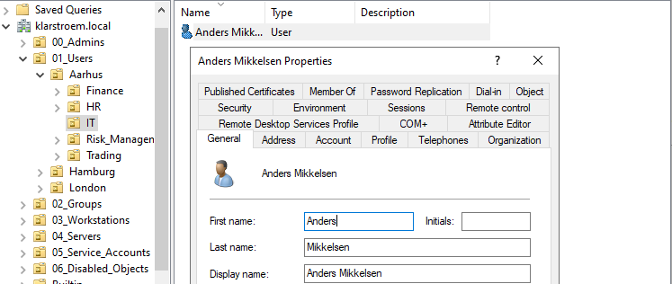
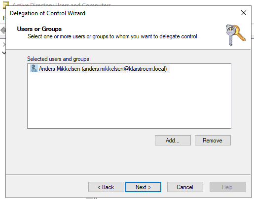
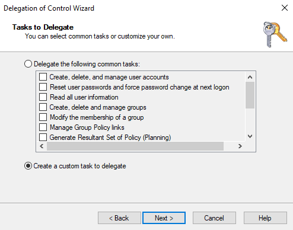
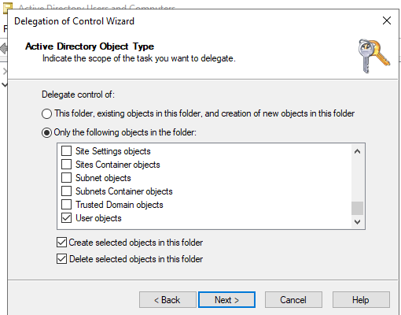
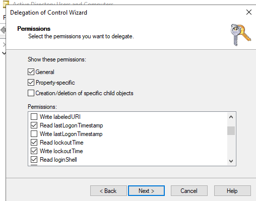
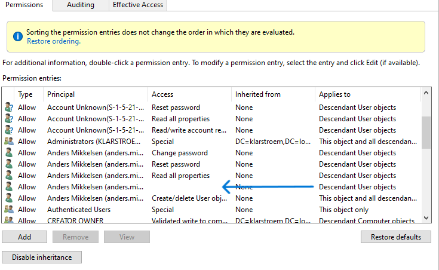

# Delegating limited administrative control

## Overview
This lab focuses on implementing delegated administrative control within AD. Instead of granting full administrative privileges, specific permissions were delegated to a helpdesk user account to allow password resets, and account unlock privileges within a defined organizational scope, in this case applied to the Aarhus child OU under the top-level OU "Users".

Delegation was applied at the OU level to follow and enforce the principle of least privilege.

## Objectives
- Create a dedicated helpdesk administrative user
- Delegate limited administrative permissions to the helpdesk user
- Restrict admin scope to specific OU
- Implement password reset permissions
- Implement account unlock permissions
- Validate delegated admin access
- Demonstrate least privilege administration

## Environment
- Domain: klarstroem.local
- Domain controller: DC01, 192.168.56.10
- Client device: CLIENT01

Organizational structure: 
01_Users "Top-level OU"
- Aarhus "Child OU"
  - Trading "Department"
  - IT
  - HR

Administrative user:
- Anders Mikkelsen
- Role Helpdesk administrator
- Location scope: Aarhus OU

- Delegated administrative control applied to Aarhus OU
- Permissions restricted to user object management
- Full domain administrative rights not given
  
## Implementation
#### Step 1. Create the Helpdesk admin user.
Before delegation could be configured, I created a dedicated helpdesk account. The goal was to avoid highly privileged accounts like Domain admin for everyday tasks.

I started with creating a new user account inside: 01_Users -> Aarhus -> IT:

#### Step 2. Start delegation wizard
Delegation was started at the Aarhus OU because this is where the users that Anders should manage are located. By delegating at this level, permissions automatically apply to all users inside Aarhus and any child OU under it, such as Trading and the other ones.

This keeps administration organized and avoids assigning permissions to each user individually.
- I right clicked on the Aarhus OU and chose -> Delegate control
- Add Anders Mikkelsen:
  
- Select **Create a custom task to delegate**:
  

#### Step 3. Limit delegation to user objects
At this point, I restricted delegation to **User Objects only**. The reason for this was to prevent the helpdesk from managing other types of objects like groups or devices.

This follows the principle of least privilege. Anders only needs to manage users, so there is no reason to give him permissions to other objects.

#### Step 4. Assign basic helpdesk permissions
Next, I assigned the basic helpdesk permissions required for everyday tasks. Instead of granting broad administrative access, I focused only on the actions needed to support users, such as resetting passwords and unclocking locked accounts.

All permissions were selected from the same permission screen, which allows both general and property-specific permissions to be configured together.

The following permission were selected:
- Read all properties
- Reset password
- Change password
- Read lockoutTime
- **Write lockoutTime**
- Create/ delete user objects

These permissions allow the helpdesk account to:
- View user account details
- Reset user passwords
- Unlock locked user accounts

Unlocking accounts specifically requires access to the lockoutTime attribute, which is why both read and write permissions for this attribute were selected:

#### Step 5. Verify delegation was applied
After finishing the wizard, I verified that the permissions were applied correctly. This step helps catch mistakes early, especially if inheritance is misconfigured.

The key thing I checked was whether the permissions applied to **descendant user objects**, meaning users inside Aarhus and its child OUs:  
- Right click Aarhus OU -> Properties -> Security -> Advanced
- The confirm: anders.mikkelsen appears with -> Applies to: Descendant User objects

NOTE: on the screenshot above, there is an empty access field, I dobble clicked and checked what permission it holds and can confirm it is the **Write lockoutTime** permission.

## Verification

## Results

## Lessons Learned

## Next steps
