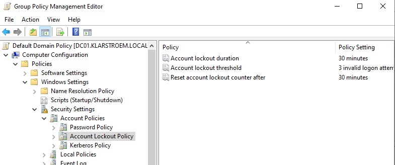
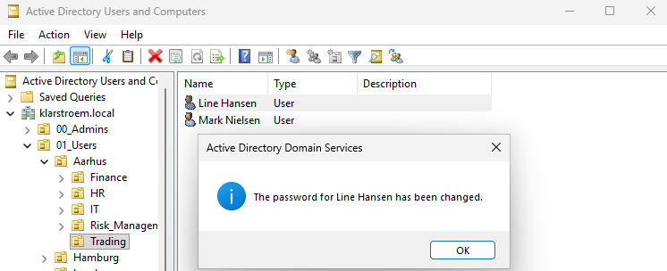
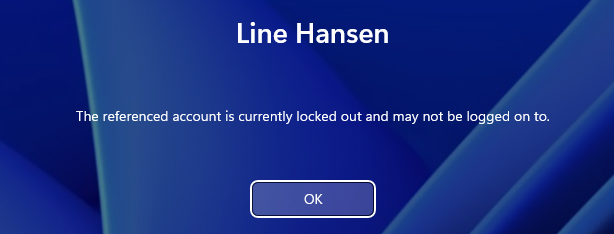
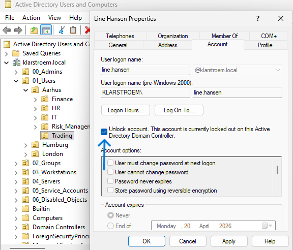
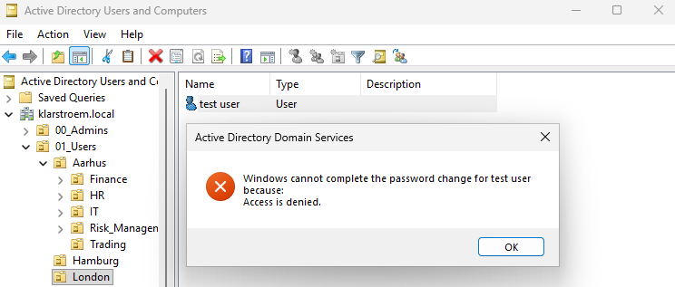

# Delegating limited administrative control

## Overview
This lab focuses on implementing delegated administrative control within AD. Instead of granting full administrative privileges, specific permissions were delegated to a helpdesk user account to allow password resets, and account unlock privileges within a defined organizational scope, in this case applied to the Aarhus child OU under the top-level OU "Users".

Delegation was applied at the OU level to follow and enforce the principle of least privilege.

## Objectives
- Create a dedicated helpdesk administrative user
- Delegate limited administrative permissions to the helpdesk user
- Restrict admin scope to specific OU
- Implement password reset permissions
- Implement account unlock permissions
- Validate delegated admin access
- Demonstrate least privilege administration

## Environment
- Domain: klarstroem.local
- Domain controller: DC01, 192.168.56.10
- Client device: CLIENT01

Organizational structure: 
01_Users "Top-level OU"
- Aarhus "Child OU"
  - Trading "Department"
  - IT
  - HR

Administrative user:
- Anders Mikkelsen
- Role Helpdesk administrator
- Location scope: Aarhus OU

- Delegated administrative control applied to Aarhus OU
- Permissions restricted to user object management
- Full domain administrative rights not given
  
## Implementation
#### Step 1. Create the Helpdesk admin user.
Before delegation could be configured, I created a dedicated helpdesk account. The goal was to avoid highly privileged accounts like Domain admin for everyday tasks.

I started with creating a new user account inside: 01_Users -> Aarhus -> IT:

#### Step 2. Start delegation wizard
Delegation was started at the Aarhus OU because this is where the users that Anders should manage are located. By delegating at this level, permissions automatically apply to all users inside Aarhus and any child OU under it, such as Trading and the other ones.

This keeps administration organized and avoids assigning permissions to each user individually.
- I right clicked on the Aarhus OU and chose -> Delegate control
- Add Anders Mikkelsen:
  
- Select **Create a custom task to delegate**:
  

#### Step 3. Limit delegation to user objects
At this point, I restricted delegation to **User Objects only**. The reason for this was to prevent the helpdesk from managing other types of objects like groups or devices.

This follows the principle of least privilege. Anders only needs to manage users, so there is no reason to give him permissions to other objects.

#### Step 4. Assign basic helpdesk permissions
Next, I assigned the basic helpdesk permissions required for everyday tasks. Instead of granting broad administrative access, I focused only on the actions needed to support users, such as resetting passwords and unclocking locked accounts.

All permissions were selected from the same permission screen, which allows both general and property-specific permissions to be configured together.

The following permission were selected:
- Read all properties
- Reset password
- Change password
- Read lockoutTime
- **Write lockoutTime**
- Create/ delete user objects

These permissions allow the helpdesk account to:
- View user account details
- Reset user passwords
- Unlock locked user accounts

Unlocking accounts specifically requires access to the lockoutTime attribute, which is why both read and write permissions for this attribute were selected:

#### Step 5. Verify delegation was applied
After finishing the wizard, I verified that the permissions were applied correctly. This step helps catch mistakes early, especially if inheritance is misconfigured.

The key thing I checked was whether the permissions applied to **descendant user objects**, meaning users inside Aarhus and its child OUs:  
- Right click Aarhus OU -> Properties -> Security -> Advanced
- The confirm: anders.mikkelsen appears with -> Applies to: Descendant User objects

NOTE: on the screenshot above, there is an empty access field, I dobble clicked and checked what permission it holds and can confirm it is the **Write lockoutTime** permission.

#### Step 6. Configure Account Lockout Policy

To test unlock functionality, I configured an account lockout policy. Without this, accounts would never lock, and it would not be possible to test whether delegation worked correctly.

This step also reflects real-world security settings used to prevent repeated password guessing.

I opened Group Policy Management:
- Default domain policy -> Edit -> Windows settings -> Security settings -> Account policies -> Account lockout policy

Configure: 
- Account lockout threshold: 3 invalid attempts
- Account lockout duration: 30 min
- Reset lockout counter after: 30 min

Then I applied the policed and ran **gpupdate /force** in cmd:

## Verification
After completing the delegation, I tested the configuration from a client machine using the helpdesk account Anders Mikkelsen.

First, I verified password reset functionality. I logged in as Anders on the client PC and opened Active Directory Users and Computers. I navigated to the Aarhus -> Trading OU and selected Line Hansen. From there, I reset her password. The operation completed without errors, which confirmed that the reset password permission was working:

Next, I tested account lockout. I logged out and attempted to sign in as Line Hansen using the wrong password several times. After the configured threshold was reached, the account became locked. This confirmed that the account lockout policy was active:

After the account was logged, I signed back in as Anders and opened Line's account properties. The message indicating that the account was locked was visible. This time, the unlock account option was available and not greyed out. I selected the option and applied the changes. After unlocking the account, Linme Hansen was able to sign in again.

At the end, I tested the delegation scope. While logged in as Anders, I attempted to manage users outside the Aarhus OU. users located in other locations were not accessible for administrative actions. This confirmd that the delegated permissions were correctly limited to the Aarhus OU:

## Results
The delegated helpdesk permissions worked as intended after the correct permissions were assigned.

The helpdesk account was able to reset passwords and unlock accounts within the Aarhus OU. Ealier in the process the unlock option stayed unavailable, which helped me identify that the Write lockoutTime permission was missing. After adding this permissin, unlocking accounts worked.

User account lockout behaviour followed the configured policy, and the helpdesk account was able to resolve locked accounts whitout requiring Domain admin privileges.

## Lessons Learned
Delegation is highly dependent on the OU structure. Where permission are applied determines how far they spread. Starting delegation at the correct level/ OU makes management easier and avoids repeating the same configuration several times.

Permission in AD are split accross multiple entries. Seeing the same user appear several times in the permission list is normal and represents different individual permissions.
