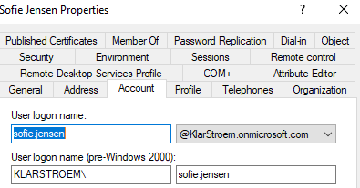

# UPN Alignment before synchronization

## Overview
Before configuring Entra ID Connect, I reviewed the user logon formats in both the on-prem AD and in Entra ID. I noticed that the domain suffix used on-premise was different from the one used in the cloud tenant. Since synchronization depends on matching identities correctly, this needed to be handled before moving forward with hybrid identity.

This lab focuses on aligning the UPN suffix in AD so that it matches the Entra ID tenant domain. Instead of changing users one by one, Powershell was used to update all users in bulk.

## Objectives
- Identify differences between on-prem and cloud UPN formats
- Understand why UPN alignment is required before synchronization
- Add the cloud user UPNs using powershell
- Verify that the new UPN format was applied successfully

## Environment
Domain controller: DC01, Windows Server 2022
Directory Domain: klarstroem.local

Organizational Unit used: 01_Users
Entra ID Tenant: KlarStroem.onmicrosoft.com

Existing on-premise format: firstname.lastname@klarstroem.local
Target format: firstname.lastname@KlarStroem.onmicrosoft.com

## Implementation

## Verification
After running the script, multiple user accounts were checked manually. 
- Opened AD Users & Computers
- Selected the different users from the 01_Users OU
- Went into properties -> Account tab
- Confirmed the User logon name showed the new domain suffix:

I checked several users from different department, and could confirm that all users had the updated domain suffix.

## Results
All user accounts in the o1_Users OU were successfully updated to use the cloud UPN format

**Old format: firstname.lastname@klarstroem.local**

**New format: firstname.lastname@KlarStroem.onmicrosoft.com**

This change ensures that users will synchronize correctly with Microsoft Entra ID during the upcoming Entra ID Connect configuration.

## Lessons Learned
This step showed how important it is to review identity formats before starting synchronization. Even small differences in domain suffix can create problems later.

Using Powershell made it possible to update all users quickly. doing this manually would have taken longer and increases the chances of mistakes.

