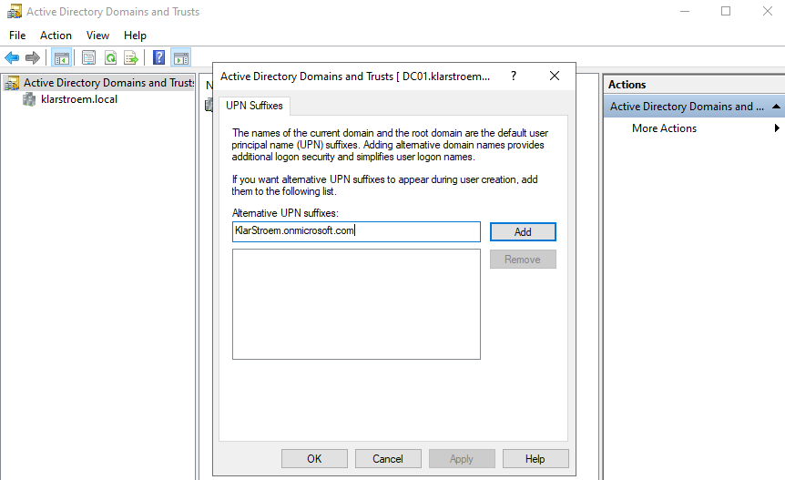
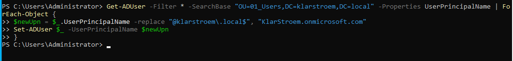
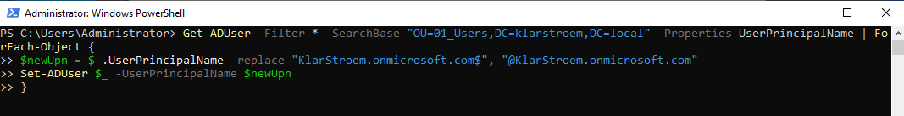

# UPN Alignment before synchronization

## Overview
Before configuring Entra ID Connect, I reviewed the user logon formats in both the on-prem AD and in Entra ID. I noticed that the domain suffix used on-premise was different from the one used in the cloud tenant. Since synchronization depends on matching identities correctly, this needed to be handled before moving forward with hybrid identity.

This lab focuses on aligning the UPN suffix in AD so that it matches the Entra ID tenant domain. Instead of changing users one by one, Powershell was used to update all users in bulk.

## Objectives
- Identify differences between on-prem and cloud UPN formats
- Understand why UPN alignment is required before synchronization
- Add the cloud user UPNs using powershell
- Verify that the new UPN format was applied successfully

## Environment
Domain controller: DC01, Windows Server 2022
Directory Domain: klarstroem.local

Organizational Unit used: 01_Users
Entra ID Tenant: KlarStroem.onmicrosoft.com

Existing on-premise format: firstname.lastname@klarstroem.local  
Target format: firstname.lastname@KlarStroem.onmicrosoft.com

## Implementation
#### Step 1 - Add the cloud UPN suffix to Active Directory
Before updating any user accounts, the cloud domain suffix had to be added to Active Directory. By default, the domain only allows the local suffix **@klarstroem.local**

Since Microsoft Entra ID uses **@KlarStroem.onmicrosoft.com**, this suffix needed to be available in AD before assigning it to users. This was completed by following these steps:
- On the domain controller, open Server Manger
- Navigate to Tools
- Select Active Directory Domains and Trusts
- Right-click AD Domains and Trusts
- Select Properties
- Then add the new domain suffix

This step made the cloud suffix available as a valid login option in AD. without this step, it would not have been possible to assign users a cloud UPN.

#### Step 2 - Update all user UPN suffix using PowerShell
After adding the new suffix, all users needed to be updated so their UPN matched the cloud domain.

Instead of changing each user manually, PowerShell was used to update all users in the **01_Users** OU at once. This shows how bulk update are handled in real organizations.

The script performed the following:
- Retrived all users from the 01_Users OU
- Read their current UPN names
- Replaced the .local suffix with the cloud suffix
- Updated the UPN for each user

PowerShell Command used:

#### Step 3 - Correct missing @ symbol using a second script
After I ran the first script, I noticed that the @ symbol was missing from the updated UPN.

This issue happened because of a small mistake in the replacement string. Because the update was performed in bulk, the correction also needed to be done in bulk.

A second PowerShell script was used to fix the affected values by inserting the missing @ symbol into the domain portion of the UPN:

## Verification
After running the script, multiple user accounts were checked manually. 
- Opened AD Users & Computers
- Selected the different users from the 01_Users OU
- Went into properties -> Account tab
- Confirmed the User logon name showed the new domain suffix:

After running this script, user logon names were updated automatically across all accounts in the OU.

I checked several users from different department, and could confirm that all users had the updated domain suffix.

## Results
All user accounts in the o1_Users OU were successfully updated to use the cloud UPN format

**Old format: firstname.lastname@klarstroem.local**

**New format: firstname.lastname@KlarStroem.onmicrosoft.com**

This change ensures that users will synchronize correctly with Microsoft Entra ID during the upcoming Entra ID Connect configuration.

## Lessons Learned
This step showed how important it is to review identity formats before starting synchronization. Even small differences in domain suffix can create problems later.

Using Powershell made it possible to update all users quickly. doing this manually would have taken longer and increases the chances of mistakes.

