# Install and configure Microsoft Entra Connect Sync

## Overview
In this lab, I'm going to install and prepare a dedicated Windows Server to be the synchronization server between the on-premise Active Dirctory environment and Microsoft Entra ID.

## Objectives
- Deploy a dedicated Windows Server to be the synchronization server between on-premise Active Directory and Entra ID.
- Install Microsoft Entra Connect Synch
- Configure synchronization between the on-premise Active Directory and the Entra ID Tenant
- Validate that objects created in Active Directory are synchronized to Entra ID
- Verify that password changes performed on-premise are successfully synchronized to Entra ID
- Confirm that synchronized users can authenticate to Microsoft cloud services using on.prem credentials
- Document key configuration decisions, including domain filtering, OU selection, and synchronization settings.
- Troubleshoot sync and permission issues

## Environment
Domain: klarstroem.local  
Entra Tenant: KlarStroem.onmicrosoft.com  
Domain Controllers:
- DC01: 192.168.56.10
- DC02. 192.168.56.11

Synchronization server:
- SYNC01: 192.168.56.12

Network model:
- Host-only adapter for internal communication
- NAT adapter for internet access

## Implementation
**Preparation**  
Before installing Microsoft Entra Connect, I installed and configured a decdicated Windows Server 2022 called SYNC01. The server was configured using the same baseline configuration used in previous server deployments in this project "DC01, DC02"

I domain-joined the server to the klarstroem.local Active Directory domain and placed it in the Servers/ Infracstructure OU. Network connectivity was verified and tested to ensure connection between servers and with external internet resources.

DNS settings were configured to point to the domain controllers, and time sync was confirmed to prevent authentication and sync issues.

**Step 1 - Download Entra Connect Sync**  
I started the installation from the decidated synchronization server, SYNC01. From that server I signed in to my Entra ID tenant, and from  here I downloaded the installer: 
- Entra ID Blade -> Entra Connect -> Connect sync

I chose connect sync instead of Cloud Sync because I wanted my lab to reflect a moretraditional enterprise setup. Cloud Sync is lighter and easier to deploy, but connect Sync is still the most used in organizations and runs on a dedicated server and need more control. Since the purpose of this lab is to build a realistic on.premise to cloud synchronization environment, Connect sync was the better option. 

Additionally, I used this resource to better understand the differences between the two main options and their capabilities: [Connect Sync VS Cloud Sync](https://learn.microsoft.com/en-us/entra/identity/hybrid/common-scenarios)

**Step 2 - Running the installer and selecting custom configuration**  
After downloading the installer, I ran Microsoft Entra Connect Sync setup on the SYNC01 server using admin privleges. The installer started by presenting two configuration options: *Express option* and *Customize Option*

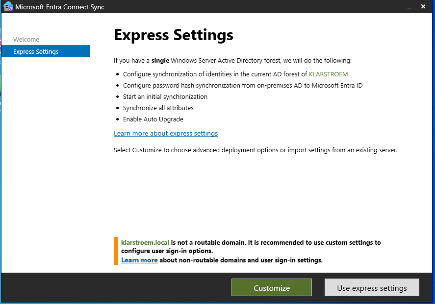

Even though Express in my case would work because of a simple environment with a single forest, I chose the *Customize* optin. This allowed me to manually review and configure each step/ stage of the installation instead of relying on default settings.

Choosing Customize gave me a better understanding and visibility into the configuration process and allowed me to control important settings such as sign in method, directory connection, filering options, and optional features. This lab focuses on understanding synchronization and not just deploy it, then custom configuration option made more sense to me.

**Step 3 - Install required components**  
After selecting the custom configuration option, the installer moved to *Required Components* section. The installer checked the server and confirmed that no existing synchronization service is installed.

Since this was the first time deploying Entra connect Sync in the environment, none of the advanced installation options were selected.

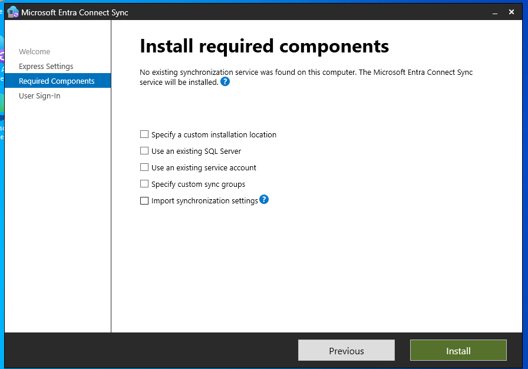

Still I think it's important to understand these options:
- Sepcify a Custom installation location: The default installation path was used because there was no requirement to change the location.
- Use an existing SQL Server: This option was not required because the installer automatically deploys a local SQL Server Express instance. Thi sdatabase is used to store synchronized identity data, track changes, and maintain synchoronization state between Active Directory and Entra ID.
- Use an existing Service Account: This was not selected because no sync acoount existed yet. The installer later created the required Active Directory account automatically, which is used to read directory objects.
- Specify custom sync groups: This option was not required in this lab because default permissions are sufficient.
- Import sync settings: This optiopn is used when rebuilding or migrating an existing sync server. Since this was my first deployment, there were no previous settings to import.

**Step 4 - Select the user sign-in method**  
At this point I had to choose the user sign-in method, and I went with Password Hash Synchronization. 

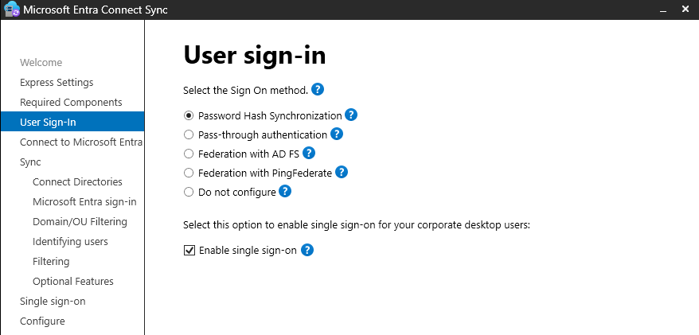

I chose PHS because it is one of the most used methods in hybrid setups. It is also the simplest to maintain compared to other methods that require additional infrastructure. In this setup, password hashes from the on-premise Active Directory are synchronized to Entra ID. The hashed passwords from on-premise are processed again and re-hashed before being stored in the cloud, and user authentication is then handled by Entra ID instead of the domain controller.

I also enabled the option called sigle sing-on. This allows users who are signed in to their domain-joined computers to access cloud services without having to type their password again. This improves the user experince and reduces the number of times users need to enter credentials and use MFA.

**Additional note**: Even though PHS was selected in this step, this does not replace the authentication methods used inside the on-premise environment. Users who sign in to domain-joined computers inside the local network are still authenticated by Active Directory using Kerberos. PHS only affects how authentication works when users access cloud services.

When users access cloud resources, authentication is handled by Entra ID instead of the domain controller. In most modern environments, this authentication rpocess uses protocols such as OpenID Connect for authentication and OAuth 2 for Authorization.

Understanding how these protocols, methods and tokens work is important to me, but this lab focuses only on configuring the sync setup. The detailed authentication flow, including access tokens, and ID token, will have their own dedicated labs.

**Step 5 - Connecting to Entra ID**  
After selecting the sign-in method, the installer wanted me to connect the syncronization server to Entra ID. I signed in using my global Administrator account for the Microsoft Entra tenant. 

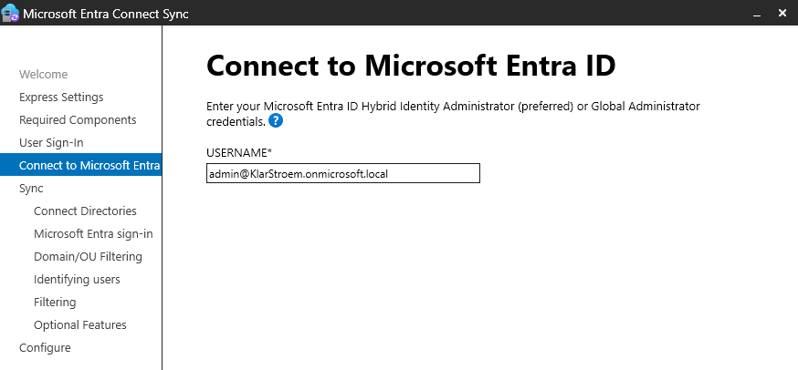

This step was required to link the synchronization server to my Entra ID tenant and allow it to create the configuration in Entra ID.

**Step 6 - Connecting to on-premise Active Directory**  
After connecting the sync server to Entra ID, the next step was to connect the on-premise Active Directory environment.

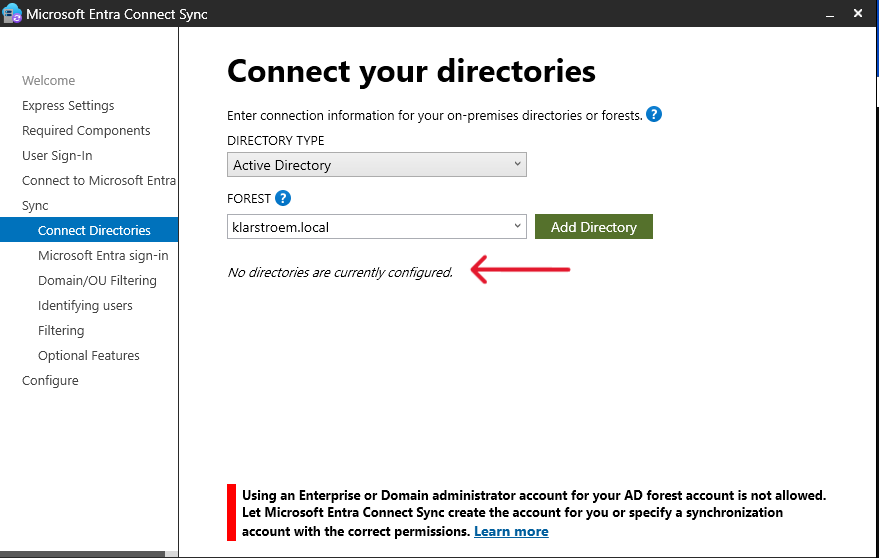

At this stage, the installer showed that no directories were currently configured. To add the on-premise environment, I selected *Add Directory* and specified the AD forest.

I then entered the credentials for the admin account with Enterprise Administrator permissions in the domain. After providing the credentials, I selected the option to create new AD account. This allows the installer to automatically create the required synchoronization account in Active Directory.

During this process, the installer created the MSOL acoount in the domain. This account is used by the synchronization service to read directory objects such as users, groups, and attributes from AD and sync them to Microsoft Entra ID:

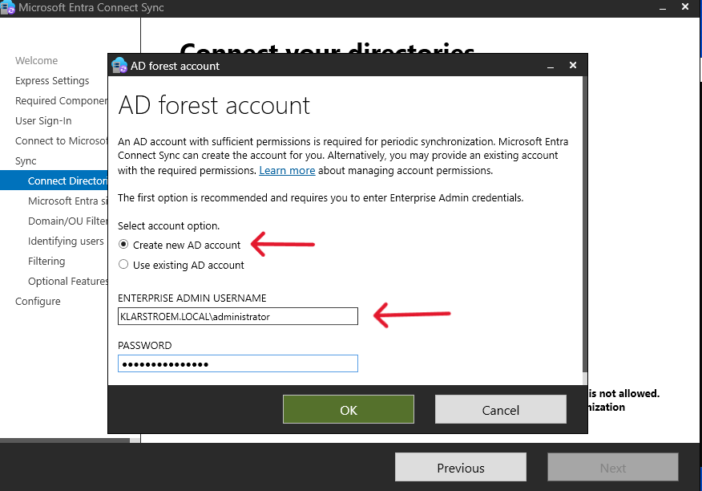

Once the credentials were verified, the installer connected to the Active Directory forest. The configured directory was then listed in the configuration window, confirming that the on-premisxe environment had been linked to the sync server:

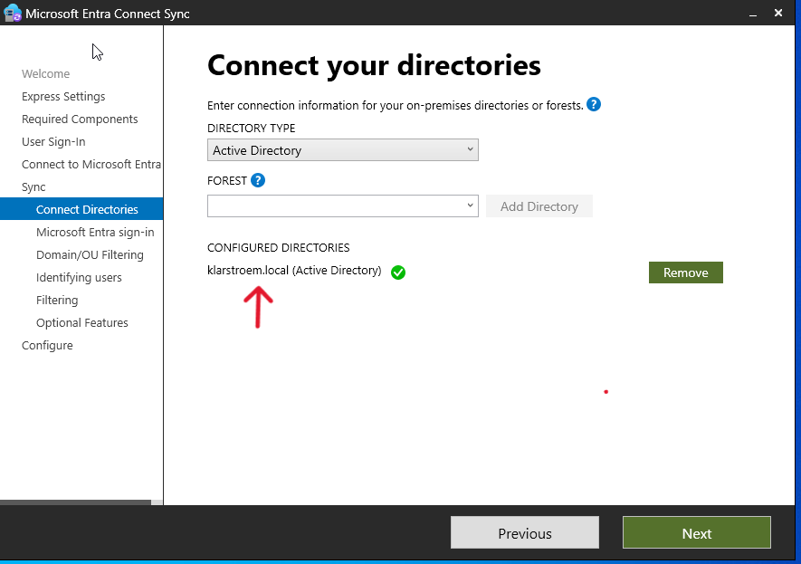

**Step 7 - Configure Microsoft Entra sign-in configuration**  
After I had connected both Entra ID and the on-premise Active Directory, the installer moved to the stage where the user sign-in configuration was reviewed.

The installer displayed the UPN suffixes detected in the on-premises environment. In my case, two suffixes were listed. The first one was the default .local domain from Active Directory, and the second one was the KlarStroem.onmicrosoft.com suffix that exists in Entra ID.

Both domain were shown with the status of *Not added*. The .local domain showed this status because it is not a routable domain and can therefore not be virified in Entra ID. This is expected in a lab environment where a .local domain is used internally. If i actually owned the domain and had used .com in stead, it then would be possible to verify the domain in Entra.

The KlarStroem.onmicrosoft.com domain also showed *Not added*, but this did not prevent the configuration from continuimg. I had already ensured that all users in AD were using the KlarStroem.onmicrosoft.com UPN suffix instead of the .local suffix. This allignment had been completed earlier using PowerShell and was documented in the previous lab.

In the same window, I selected userPrincipalName as the attribute to use as the Entra username. This ensures that the username used in Active Directory match the usernames used in Entra ID. 

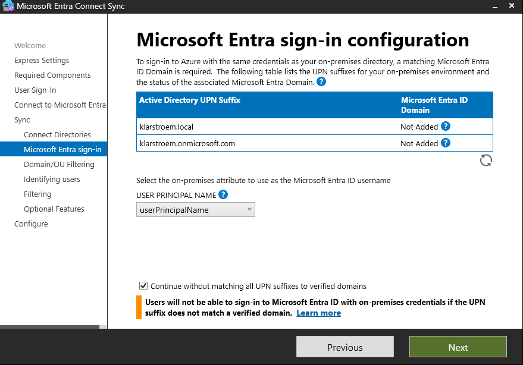

**Step 8 - Configure domain and OU filtering**  
After I had reviewed the Entra sign-in configuration, the installer mooved to the Domain and OU filtering step. I stage controls which objects from Active Directory are going to be synchronized and going to be a part of the sync proccess continuing forward.

Instead of selecting *Synchronize all domains and OUs*, I chose the option *Synchronize selected domains and OUs*. I made this decision to have better control over which objects would be synchronized to Entra ID.

From the list available OUs, I selected the top-level OUs that are used in my environment. These included:
- User objects
- Group objects
- Workstation objects

By selecting these top-level OUs, all child OUs within them were automatically included in the sync scope. This ensured that relevant user acoounts, security groups, and computer objects would be synchronized without including unnecessary objects from other parts of the directory.

Choosing selected OUs instead of synchronizing everything also reflects how many real environments are configured. It helps reduce unnecessary sync traffic and keeps the cloud directory cleaner by only including objects that are actually needed.

**NOTE:** The Organizational Unit itself is not going to be synchoronized as a unit/container. What happens is that it is the objects that are within the OU's that is going to be synchoronized. Also later if for some reason uncheck an OU for any reason, this is going to automatically remove the objects from Entra ID that sits in that particular OU. Another important note is that, if a object lives in several OU's with are checked for synchronization, does not mean we will have replicates of the same object in Entra ID.

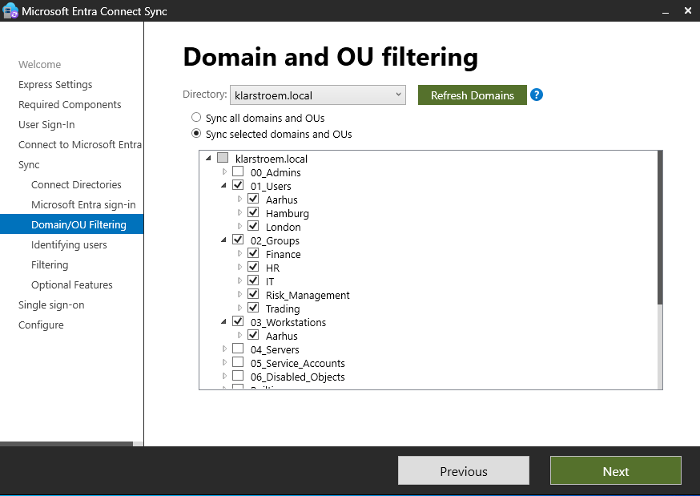

**Step 9 - Configure user identification and source anchor**  
After I had configured domain and OU filtering, the installer moved to the stage where users needed to be uniquely identified between the on-premise environment and Entra ID.

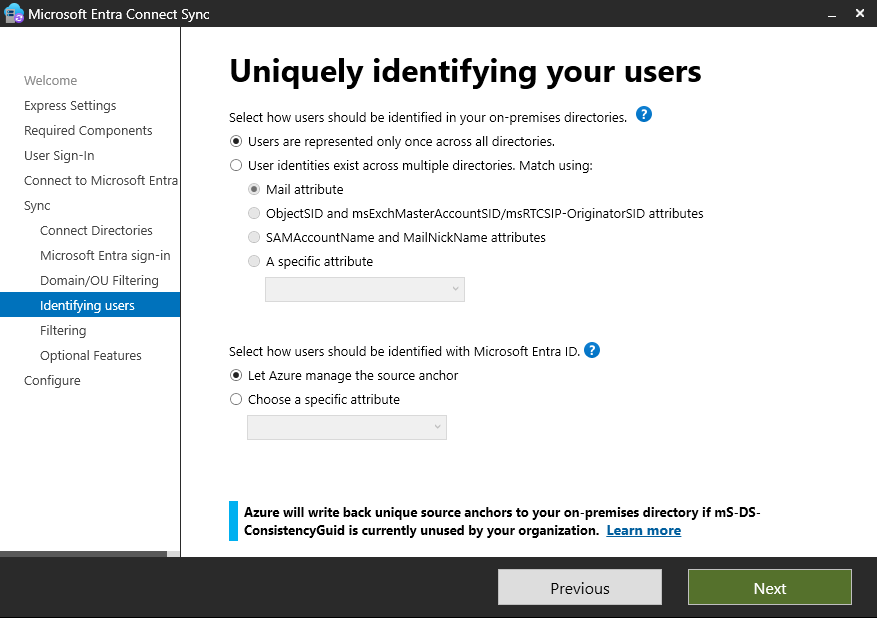

At this step, I selected the option *Users are represented only once across all directories*. This option fits environments where users exist in only one directory and are not duplicated across multiple forests. Since my lab environment only has a single Active Directory forest, this option was the correct for me.

In the next section, I selected *Let Azure manage the source anchor*. This setting allows Entra ID to automatically manage the unique identifier used to link users between AD and the cloud.

The source anchor is a unique value stored on each user object that ensures the same user is correctly matched between the on-premise directory and Entra ID. In this setup, Entra ID automatically uses the mS-DS-ConsistencyGuid attribute to create this unique identifier if it does not already exist.

Allowing Azure to manage this value simplifies the configuration and ensures that users remain correctly linked between environments, even if usernames or email addresses change later.

I verified that the mS-DS-ConsistencyGuid attribute was present on synchronized users in AD. the corresponding Immutable ID value was also visible in Entra ID, confirming that users were uniquely linked between the on-premise directory and the cloud:  
**Active Directory, Binary value**  
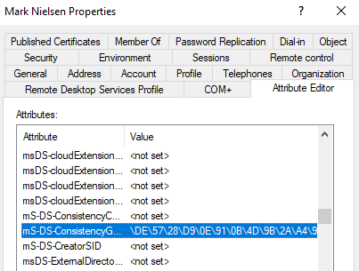

**Entra ID, Immutable ID: Base64 value**  
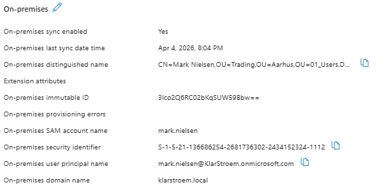

**Step 10 - Configure user and device filtering**  
Ealier I defined which OUs should be synchronized, now the installer moved to the *Filter users and devices stage*. This step gives an additional filtering option based on group membership.

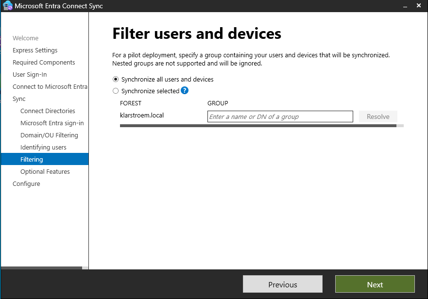

I selected the option to sync all users and devices. Since I had already limited the synchronization scope earlier by selecting specific OUs, there was no need to apply additional filtering using groups.

This option is mainly used for pilot deployments where a small number of users are synchronized for testing.

In my case, the environment was already controlled through OU filtering, and I wanted all users, groups, and devices within those selected OUs to be synchronized. Therefore, selecting *Sync all users and devices* ensured that all relevant objects within the selected OUs would be included in the sync process.

**Step 11 - Selecting optional features**  
The installer moved to the final stage the *Optional features* stage. This step allows additonal hybrid features to be selected and enabled depending on the requirements of the environment.

Here, I selected *Password writeback* and left the remaining options unselected.

Password writeback ensures password changes made in Entra ID to be written back to the on-premise Active Directory. This means that if a user changes their password in the cloud, the same password will also be updated in the local directory. This ensures that users maintain a single password across both environments and supports self-service password reset as well.

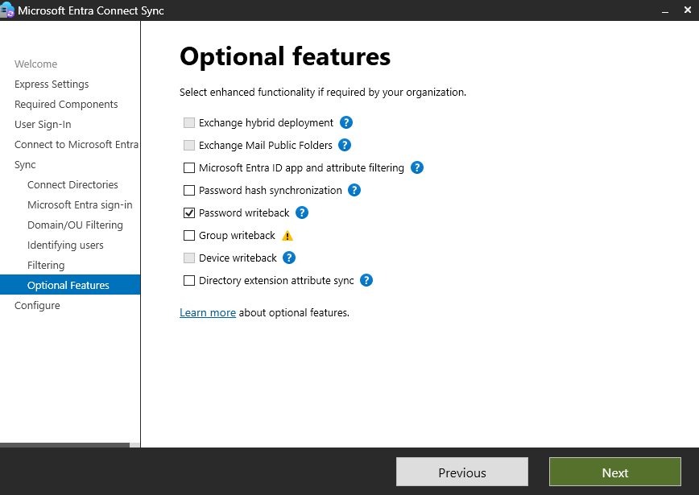

**Step 12 - Complete configuration and start synchronization**  
After I had selected the optional features, the installer completed the final configuration and showed a confirmation screen showing that the setup had finished successfully.

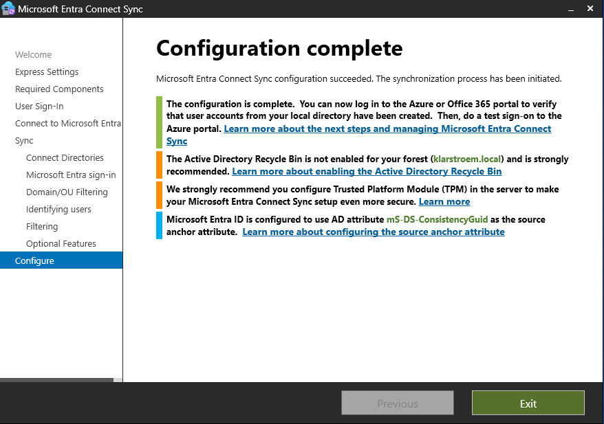

Now the synchronization service was fully configured, and the sync process was automatically started in the background.

The confirmation screen also provided several informational messages. One of the messages confirmed that Microsoft Entra ID was configured to use the mS-DS-ConsistencyGuid attribute as the source anchor. This matched the previous step where Azure was allowed to manage the unique identifier used to link users between the on-premise directory and Entra ID.

The additional recommendations were displayed, including enabling the AD Recycle Bin and configuring Trusted Platform Module support on the server. I noted these down to implement them later in my project.

After confirming that the configuration completed successfully, I exited the installer and proceeded to verify that the synchronization process was working.

## Verification 
**Test 1 - Initial sync verification**  
After completing the Entra Connect Sync installation, the initial sync started automatically in the background. The first test is to confirm that the selected OUs were successfully synchronized to Entra ID.

To verify this, I signed in to Entra admin center and navigated to the Users section. I reviewed the list of users and confirmed that the user accounts from the selected on-premise OUs were synchronized to Entra ID:  
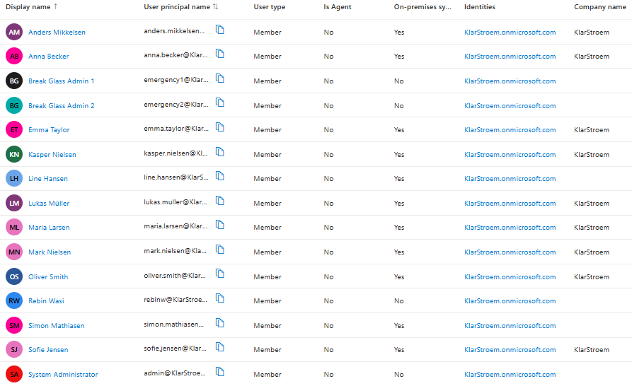

The synchronized users showed On-premise sync enebled set to Yes, which confirmed that the accounts were linked to the on-premise Active Directory environment. The usernames also matched the UPN suffix that had been configured earlier during the UPN alignment step.

I then navigated to the Groups section in Entra ID and verified that the security groups located in the selected OUs were also present. These groups showed Windows Server AD as the source, confirming that they came from the on-premise directory:
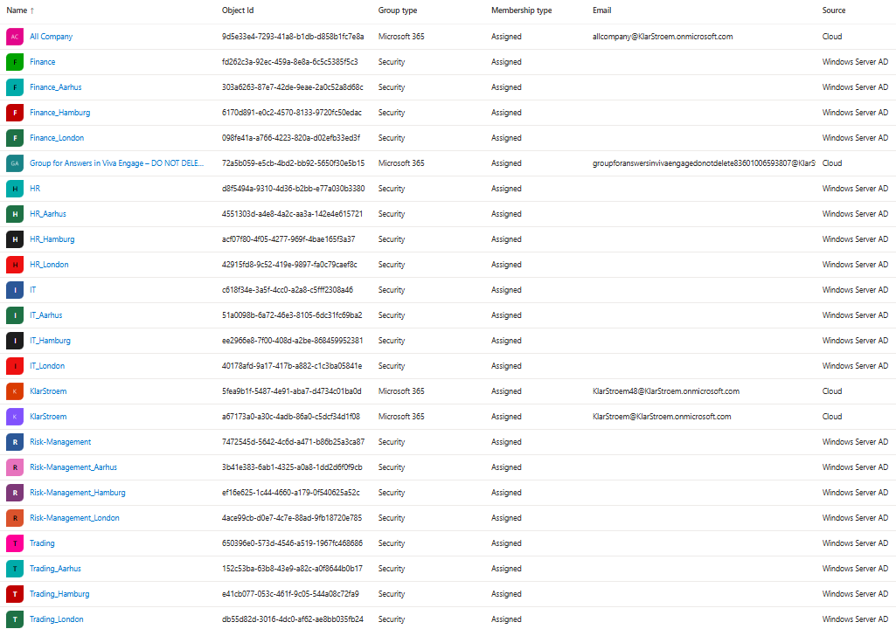

**Test 2 - Create test user and verify synchronization**  
After confirming that the initial synchronization completed successfully, the next step was to verify that new changes in AD would be synchronized correctly to Entra ID.

To test this, I created a new test user in AD. The user was created inside one of the previously selected OUs under the Users OU. During the creation process, I assigned the UPN using the cloud-aligned suffix that had been configured earliers:  
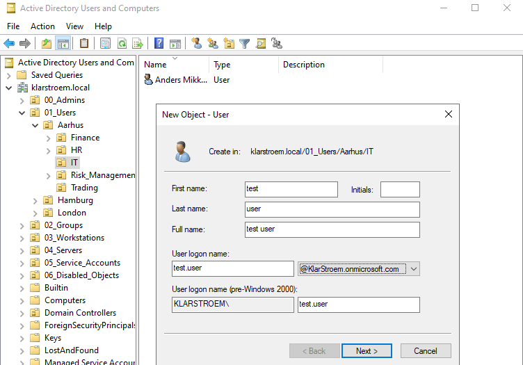

After I had created the test user, I moved to the synchronization server and manually triggered the sync using PowerShell. I ran the following command:  
*Start-ADSyncSyncCycle -PolicyType Delta*  

This command forces a delta sync, which synchronizes only changes made since last sync cycle. The command returned a success result:  
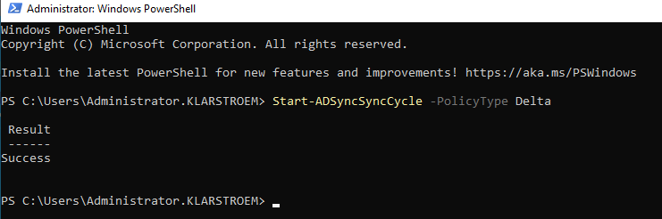

After I waited about 1 minute, I signed in to the Entra Admin Center and confirmed that the new test user had synchronized successfully to Entra ID:  
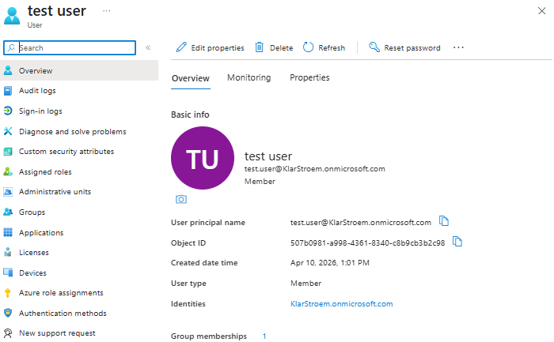

**Test 3 - Password reset in Active Directory and verify cloud sign-in**  
After confirming that the test user was successfully synchronized, the next step was to verify that password changes made in AD were also synchronized to the cloud.

To test thus, I opened AD Users and Computers on the domain controller and selected the previously created test user and reset the password for that user.

After resetting the password, I moved to the synchronization server and manually forced synchronization.

After waiting a couple of minutes, I then navigated to portal.office.com and tried to sign in using the test user account with the newly assigned password. The sign-in completed successfully, but it first required me to set up authenticater because of the default security settings we have applied in Entra ID at this stage.

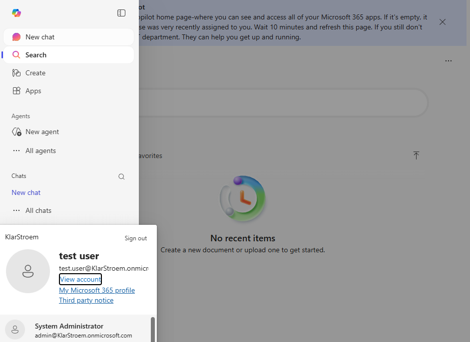

**Test 4 - Password reset from cloud -> Writeback to AD**  
I tried to reset the test user's password from the Microsoft Entra admin center to verify password writeback to AD. The reset failed, as password writeback requires Entra ID P1 licensing. This test will be revisited later when I Active my Entra ID P2 Trail license.

## Results
The synchronization server was successfully deployed and connected to both Microsoft Entra ID and the on-premise Active Directory environment. Users and groups from the selected OUs were synchronized to Entra ID, and new users created in AD were successfully synchronized after running a delta sync. Password changes made in AD were also reflected in the cloud, confirming that password hash sync was working.

## Lessons Learned
This lab improved my understanding of hybrid identity synchronization, especially UPN alignment, OU filtering, and manual synchronization using powershell. I also learned that password writeback requires Premium licensing, which prevented full testing at this point.
