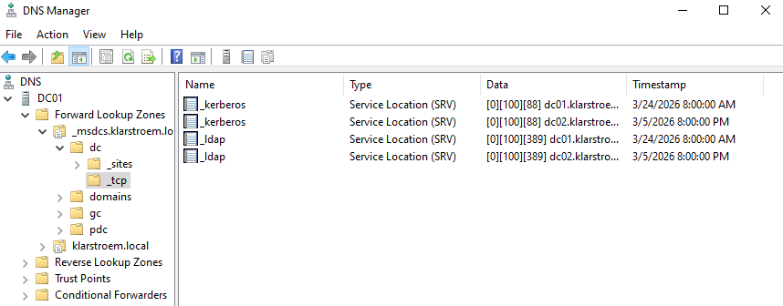
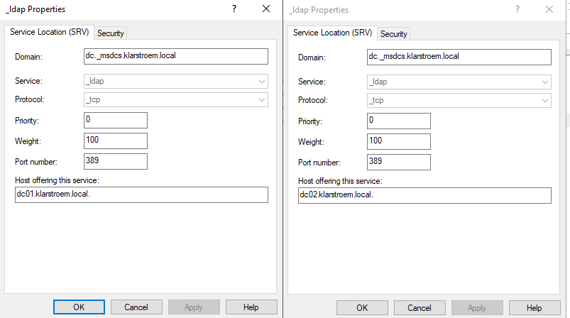
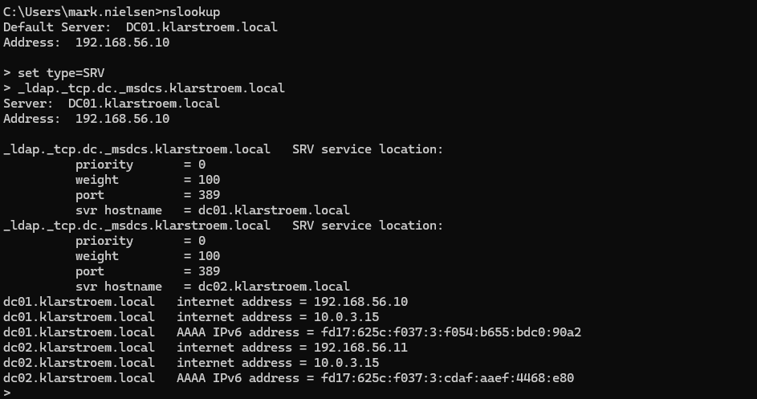
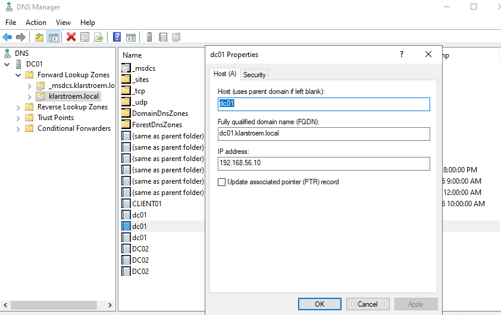

# Kerberos authentication and ticket lifecycle analysis in AD

## Overview
This lab shows how Kerberos authentication works in Active Directory domain environments. The goal is to observe how a domain-joined client locates domain controllers using DNS SRV records, authenticates using Kerberos, recieves a Ticket Granting Ticket "TGT", and later requests service tickets when accessing network resources.

The lab focuses on understanding the authentication flow rather than performing configuration. We're going to take a closer look at the role of DNS in locating domain controller, the use of password-derived encryption during authentication, and the lifecycle of Kerberos tickets stored on the client PC.

## Objectives
- Understand how domain-joined clients locate domain controllers using DNS SRV records
- Understand how Kerberos authentication begins after domain controller discovery
- Verify that a TGT is issued after successfull authentication
- Take a closer look on how service tickets are generated when accessing resources
- Analyze Kerberos-related security events on the DC

## Environment
Domain: klarstroem.local

Servers:
- DC01 Domain controller, DNS Server, Kerberos Key Distribution Center "KDC"
- DC02: Domain controller, DNS Server

Client:
- CLIENT01: Domain-joined Windows PC

## Implementation
#### Step 1 - Client startup and domain controller discovery
When the client computer starts, it recieves an IP and DNS configuration normally from DHCP, but in my case I have set static values. The DNS server assigned to the client is the domain controller.

When the user logs in using a domain account, the client must first locate the available domain controllers before the authentication process can begin.

The clienmt PC sends a DNS SRV query to locate the domain controllers providing LDAP services. The query searches for domain controllers registered under the LDAP service in the domain. The SRV query used by the client:
- _ldap._tcp.dc._msdcs.klarstroem.local
- _service_protocol.dc_msdcs.domainName

Each part of this query:
- _ldap: specifies the requested **service**. in this case, LDAP, which is used to communicate with Active Directory
- _tcp: specifies the protocol used for communication. AD uses TCP for LDAP communication
- dc: specifies that the client is seaching for domain controllers
- _msdcs: represents Microsoft Domain Controller Services. this namespace stores service location records for domain controllers
- klarstroem.local: specifies the domain name in which domain controllers are being located

 So the full query means -> Locate all domain controllers in the klarstroem.local domain that provide LDAP services over TCP.

 When the query is recieved by the DNS server, the DNS service searches for SRV records that match this above **exact query name: - _ldap._tcp.dc._msdcs.klarstroem.local**

If the DNS server holds multiple DNS SRV records that match that exact query name, then multiple domain controllers will be returned. In my lab I have two domain controllers providing this exact service, and therefore it should return both:
- DC01.klarstroem.local
- DC02.klarstroem.local

I wasn't satisfied, I wanted to know exactly where the DNS server stores these exact SRV records, and therefore I follwed this path in the DNS Manager on my domain controller:
- Forward Lookup Zones -> _msdcs.klarstroem.local -> dc -> _tcp
Inside this location we see two LDAP SRV records because I have deployed two domain controllers:

Each records holds:
- Service: LDAP
- Protocol: TCP
- The dc.klarstroem.local string
If we combine all of these we get exactly the above mentioned query: **_ldap._tcp.dc._msdcs.klarstroem.local**

This is why when the query request and the SRV record match then the SRV records returns the hostnames seen at the bottom of the SRV record:

After the DNS server returns the list of domain controllers, the client must select one to contact.

The client does normally not randomly pick one. It evaluates the values stored inside each SRV record seen above:
- Priority: Specifies preference order. Lower values are preferred over higher
- Weight: Used for load balancing when multiple domain controllers share same priority

If multiple domain controllers have the same values for both priority and weight, the client then selects one randomly.

In large organizations, domain controllers must often distributed across multiple sites. AD clients tries to select a domain controller that is located within the same site/ network because it improves performance and reduces network latency. It is in these situations those two values above mentioned would make more sense, than in my small home lab.

**VERIFYING THE PROCESS**  
We are actually able to simulate and test the exact same SRV query the client sends out to discover the available domain controllers in its network, and hopefully we will get back the response that we have two available domain controller in our environment providing LDAP services.

On the client PC I went into command promt and typed the following:
1. nslookup: used to query DNS records manually
2. set type=SRV: Specifies that we are requesting Service Location Records
3. _ldap._tcp.dc._msdcs.klarstroem.local: this matches the exact query used by the domain-joined clients to locate domain controllers provind LDAP services-

The DNS server returned two SRV records, one for each domain controller. Each specifies the hostname of a domain controller that provides LDAP services on port 389.

This confirms that domain controller discovery through DNS is working. The returned hostnames matches directly to the SRV records located earlier in the _msdcs zone under dc -> _tcp.

#### Step 2 - Resolving domain controller hostnames to IP addresses
After the client recieved the hostnames from the SRV query, the client must resolve the selected hostname into an IP address before communication can begin.

Example: If the client selects DC01:klarstroem.local
- The client then sends a second DNS query requesting the IP address associated with that hostname.
- DMS then searches the Forward Lookup Zone -> klarstroem.local
- Within this zone, an A record exists that maps DC01 to an IPv4 address

This step allows the client to establish network communication with the selected domain controller. 

If SRV record are missing or incorrect, the client will not be able to locate domain controller and the authentication cannot begin.

**VERIFYING THE HOSTNAME RESOLUTION**  
We can verify the hostname resolution using the same nslookup output shown in step 1. 

The command used in step 1 was used to discover domain controllers, the output also included IP address resolution for each hostname. 

This confirms that after recieving the domain controller hostnames, the client automatically resolves each hostnames into IP addresses:

The nslookup output shows the following hostname-to-IP:
dc01.klarstroem.local -> 192.168.56.10
dc02.klarstroem.local -> 192.168.56.11

These addresses represent the primary communication addresses used by the client to contact the domain controllers.

The output also shows multiple IP addresses for each domain controller. This is because each domain controller has two network adapters in our setup.
1. Adapter is connected to the internal network "Host-Only adapter" -> 192.168.56.0
2. Adapter is used for external communication "NAT adapter" -> 10.0.3.0

#### Step 3 - Kerberos authentication service request (AS-REQ)
After the client selected a domain controller and resolved its hostname to an IP address, the client is ready to authenticate using the Kerberos protocol.

At this point, the client sends an authentication service request also called AS-REQ, to the Key Distribution Center (kdc). The KDC is a service running on the domain controller.

Purpose of the AS-REQ: The purpose of the AS-REQ is to prove the identity of the user and request a Ticket Granting Ticket (TGT).

The client does not send the password or even the password hash across the network. The password is used locally on the client PC to generate a secret encryption key. 

**Password-Derived Key Creation**: When the user enters the password during login, the client system generates a cryptographic key created from the password. The process: The client takes the entered password and applies a cryptographic transformation to to create a secret key. This key is not send across the network.

The key is instead used to encrypt a timestamp. The timestamp proves that the authentication request is new and helps protect against replay attacks. This entrypted timestamp is a part of the AS-REQ. The AS-REQ message usually contains:
- username
- Domainname
- Service requested: krbtgt/domain_name. This shows that the client is requesting a Ticket Granting Ticket
- Timestamp: Encrypted using the password
- Client information: encryption types used by the client

Important: The AS-REQ does not contain any service tickets at this stage. The client is only requesting a TGT ticket.

**Password validation by the domain controller**: After the domain controller has recieved the AS-REW, it then processes the request through its Key Distribution Center service:
1. The KDC locates the user account in AD
2. The KDC retrives the stored password hash associated with the user account
3. Using the stored password hash, the KDC creates the same key that the client created
4. The KDC uses this key to decrypt the encrypted timestamp

If the timestamp decrypts successfully, this confirms that the client used the correct password-derived key. This means the user has successfully authenticated. 

**The authentication Service Reply (AS-REP)**
After successfull authentication, the KDC sends an Authentication Service Reply (AS-REP) back to the client.

This reply/ message contains:
- Ticket Granting Ticket: This is the primary Kerberos ticket. It proves that the user has successfully authenticated
- Session Key: Used for secure communication between the client and the KDC
- Ticket lifetime information: Shows how long the ticket is valid
- Authorization data: includes information such as group membership of the user and user identity

## Verification

## Results

## Lessons Learned

## Next steps
