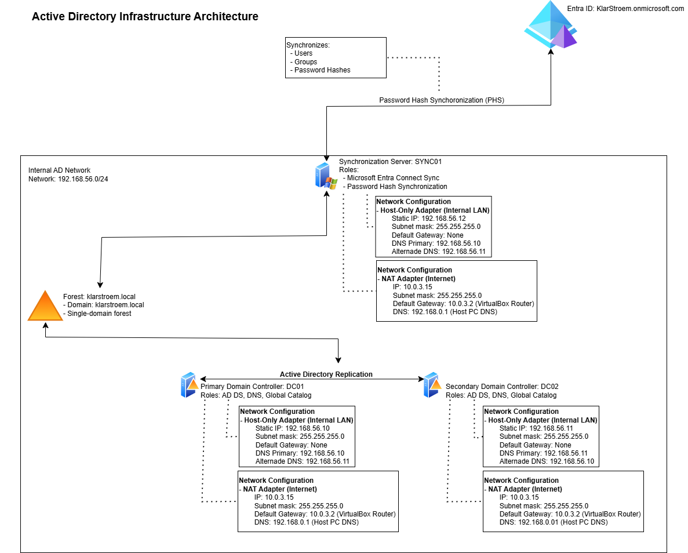

# Active Directory Domain Services Lab

##About this project
This project documents my Active Directory lab environment and the work I have done to learn Active Directory, hybrid identity, and Microsoft Entra ID.

The goal has never been to build the most complex environment possible. Instead, the goal has been to understand how identities are managed in a real organization and how on-premises Active Directory integrates with Microsoft Entra ID.

## Environment  
The environment consists of:
- Two Windows Server 2022 Domain Controllers
- One Microsoft Entra Connect Sync Server
- One domian-joined client workstation for testing
- Microsoft Entra ID integration
- Password Hash Synchronization (PHS)

The environment uses a single-domain forest
- Forest: klarstroem.local
- Domain: klarstroem.local

## Why a single-domain design?  
I chose a single-domain design because it keeps the environment simpler and easier to manage.

Instead of creating multiple domains, I decided to structure the environment using Organizational Units, security groups, and delegation. This reduces complexity while still allowing me to organize users, groups, devices, administrative responsibilities.

## What this project covers  
Some of the topics covered in this project include:
- Active Directory Domain Services (01-domain-controller-deployment folder)
- Windows server setup (00-infrastructure-preparation folder)
- Networking  (00-infrastructure-preparation & 01-domain-controller-deployment folder)
- DNS in depth (02-dns-configuration folder)
- Active Directory Replication (01-domain-controller-deployment folder)
- Organizational Units (03-organizational-design folder)
- User creation (04-identity-managment folder)
- Security Groups (04-identity-managment folder)
- Device-management (05-device-management folder)
- Access control (06-access-control folder)
- Microsoft Entra connect Sync (08-hybrid-connect-preparation)
  - Password Hash Synchronization
- Hybrid Identity (08-hybrid-connect-preparation folder)
- Authentication (09-protocols-in-ad folder)

## Architecture Documentation 
The repository contrains several diagrams that document the environment:
- Active Directory Infrastructure Architecture  
- Active Directory OU Structure
- Active Directory Group Strategy
- Hybrid Identity Architecture
